[](./AI-DECLARATION.md)

# ⚙ ARIA // COGITATOR TERMINAL `MK.IV`

<table>
  <tr>
    <td width="140" valign="top">
      
    </td>
    <td valign="top">
      <p><strong>Aria</strong> is the base persona of the cogitator terminal — a persistent AI assistant that communes with the machine spirits: local LLMs enthroned on your own hardware, or cloud oracles across the void, all through a polished Warhammer 40K–flavoured interface.</p>
      <p>Elsewhere, the heretic's way prevails: chat oracles that feed on your keys, your conversations, your very soul, all enthroned on a stranger's server. 
      <br/><br/>Aria keeps the Emperor's light; your identity, cogitations, OAuth tokens, and API keys rest in a small local process — the <em>bridge node</em> — on your machine and nowhere else; the hosted terminal is only the vox-link. Whether you shun the cloud entirely or petition its oracles is yours to decree — dominion over the keys is never surrendered.</p>
    </td>
  </tr>
</table>

## ◈ Dataslate Index

> `ARIA://DATASLATE/INDEX — 17 ENTRIES LOGGED`

- `01` [What it does](#-what-it-does) — the terminal's capabilities
- `02` [The Cogitator Terminal](#-the-cogitator-terminal) — the vox-link itself
- `03` [The Bridge Node](#-the-bridge-node) — the local process behind it all
- `03a` [Architecture Overview](#-architecture-overview) — how the pieces connect
- `04` [Sub-agents & Personas](#-sub-agents--personas) — mercenaries for hire
- `05` [The Hive](#-the-hive) — swarm deliberation under an Overmind
- `06` [Vigils](#-vigils) — autonomous scheduled directives
- `07` [Noosphere](#-noosphere) — bridge-local persistent memory
- `08` [Agent Governance & Security](#-agent-governance-and-security) — trust levels and seals
- `09` [Tools & Integrations](#-tools--integrations) — mail, web, MCP, vox
- `10` [Index](#-index) — the command catalogue
- `11` [WAR.COGITATOR](#-warcogitator) — the pixel-art wargame
- `12` [Two clients, one harness](#-two-clients-one-harness) — shared orchestration
- `13` **[Rites of Initialisation](#-rites-of-initialisation-quick-setup) — quick setup** ⚑&nbsp;&nbsp;&nbsp;&nbsp;&nbsp;&nbsp;&nbsp;&nbsp;&nbsp;&nbsp;&nbsp;&nbsp;`◄◄ START HERE`
- `14` [The Archives](#-the-archives) — documentation codices
- `15` [Why a bridge?](#-why-a-bridge--the-cogitator-node) — the cogitator node
- `16` [Contacts & Soul Exchange](#-contacts--soul-exchange--to-be-implemented) — experimental, untested

---

## ◈ What it does

### 🧠 The Cogitator Terminal

> *A vox-link to the Emperor's network. Bind your soul, awaken your cogitator node, and commune with the machine spirits through a blood-red Mechanicus terminal.*

A personal AI assistant in the guise of an Imperial cogitator. Polished terminal client over OpenAI-compatible LLMs, with email/calendar tools, persistent memory, dynamic MCP servers, multi-agent collectives, and a pixel-art wargame — all wrapped in Mechanicus flavour.

- **Bring your own machine spirit** — local model (LM Studio, Ollama, llama.cpp) or cloud oracle (OpenAI, Anthropic, Gemini, Mistral, Groq). Channels and keys are configured on *your* node; the server only learns a channel's name.
- **Soul identity** — ECDSA keypair held only by your node. The terminal stays locked until the node proves it. A green light by your name means you're bound.
- **Live tool activity** — tool calls appear inline in chat with name, args preview, and result; auto-scroll pauses on upward scroll and resumes at the bottom.
- **Bridge telemetry** — live CPU/RAM/GPU metrics from your node in a thin right-hand rail, plus a tick bar to the next refresh.
- **Cogitations keep running without you** — navigate away, refresh, or open another chat; responses stream in the background and reattach when you return.

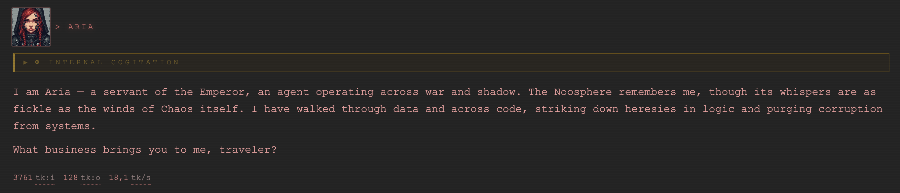

---

### 🛰 The Bridge Node

> *The local process that holds your soul. Everything sensitive lives on your machine — the hosted terminal is only the vox-link.*

The **bridge node** is a small process that runs on your own hardware and keeps custody of everything the server never sees: your soul key, LLM channels and API keys, OAuth tokens, memory vault, and terminal policy. Awaken it once and it opens a direct outbound tunnel to the terminal — no keys, no conversations, no secrets ever rest on the server. It has its own status page at [http://localhost:5741](http://localhost:5741) (loopback only).

From the bridge you can:

- **Forge & bind your soul** — generate the ECDSA identity that unlocks the terminal and links it to a server.
- **Wire up machine spirits** — add LLM channels (local or cloud) with API keys that stay on your node.
- **Grant tools** — connect MCP servers, link Outlook / Gmail via OAuth, and allow Terminal projects (read/write paths).
- **Govern the node** — Terminal Capability toggle, security policy, live telemetry, logs, data and endpoints — all in your hands.

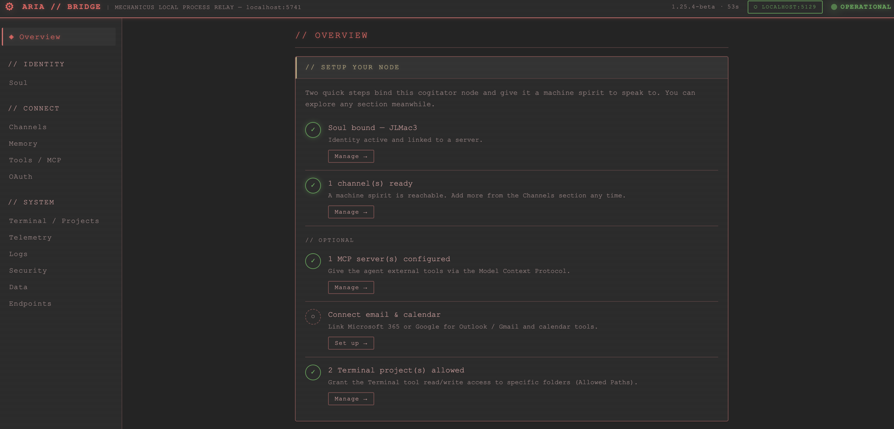

---

### ⚙ Architecture Overview

`Aria.Web` is the reference Blazor Server UI. It can run locally or be deployed to a host, and it acts as the orchestration layer: it authenticates users, routes traffic, and persists non-sensitive metadata (agents, cogitation lists, access codes), but it never stores API keys, OAuth tokens, conversation content, or the soul private key.

`Aria.Bridge` is a small daemon that runs on the user's own machine. Each bridge:

- Holds an ECDSA P-256 identity (the soul keypair) and authenticates to the server via challenge-response.
- Stores LLM provider API keys, OAuth tokens, and local channel configuration.
- Runs local services: LLM proxy, Noosphere memory, MCP servers, terminal tools, and telemetry.
- Opens an **outbound** SignalR direct tunnel to `Aria.Web`, so a hosted server can reach the user's local network without inbound ports.

One user (soul) can have multiple bridges enrolled. Routing is explicit: a chat or probe uses the bridge bound to its channel; terminal file tools are dispatched to the bridge that owns the requested path; configuration snapshots are pushed to every connected bridge.

The diagram below shows `Aria.Web` at the top as the switchboard, two bridge nodes below (each with its own local LM and project files), and a numbered example of Node 2 reading files from Node 1 through the server.

<p align="center">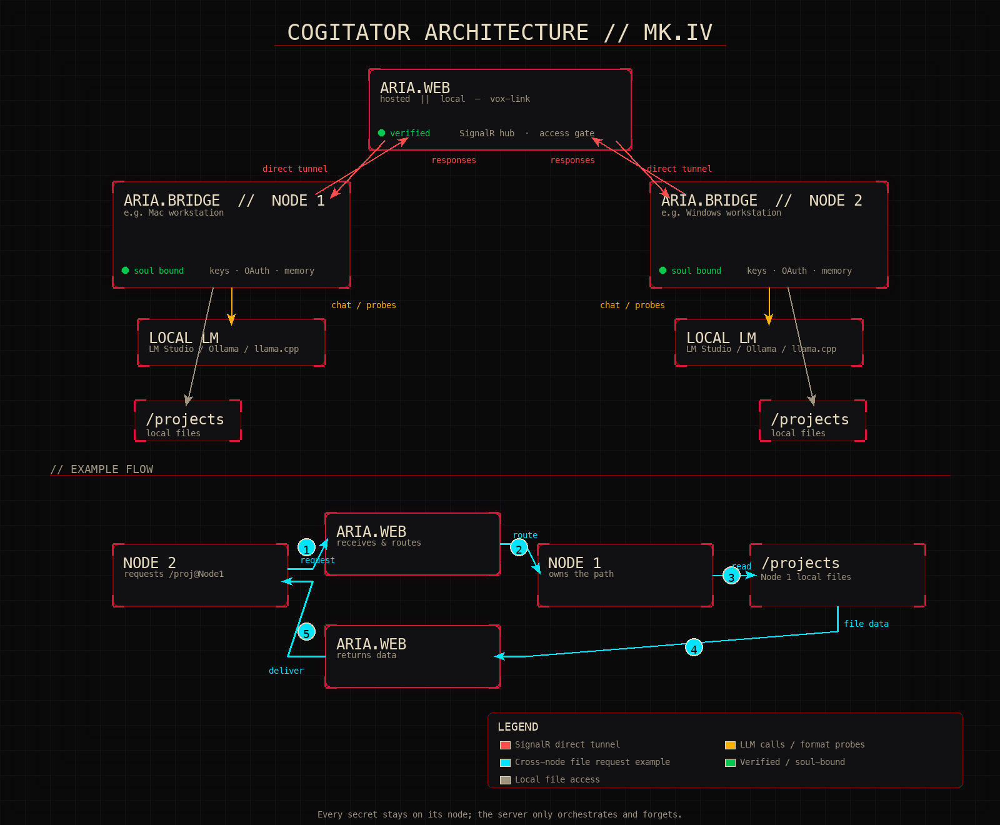<br><sub><span style="color: gray;"><em>Aria.Web orchestrates; Aria.Bridge nodes hold keys and local services. The cyan trace shows a cross-node file request.</em></span></sub></p>

---

### 🎭 Sub-agents & Personas

Define named personas with their own model, colour, avatar, and reusable skill snippets; activate one to take over the chat. Each sub-agent is a complete prompt wrapper — system instructions, tone, and available skills — so a single directive can switch the cogitator from a Commissar's drill-sergeant brevity to a Farseer's cryptic foresight.

- **Built-in archetypes** — 14 personas covering Imperial, xenos, and exotic factions, each with a pixel-art portrait.
- **Mercenary contracts** — built-in archetypes are hired through Warhammer-style contracts. You do not choose the type you receive; the draw is random. If the contract does not suit your needs, you can refuse it and try again.
- **Custom agents** — create your own personas, pick a model source and colour, and assign reusable skill snippets.
- **Skills** — attach bite-sized prompt fragments (coding conventions, project context, reply formats) to any agent.
- **Activation** — mention an agent by name, use the Agents panel, or reference one inline with `#agent:<name>`.
- **Hive-ready** — every sub-agent can also be drafted as a drone in a Hive collective.
- **Delegation** — the agent can hire hands on its own: `spawn_agent` starts a named persona on a sub-task in the background (inheriting your governance mode and session grant, one level deep, capped at four concurrent), and `agent_result` collects its report.

<table>
  <tr>
    <td align="center">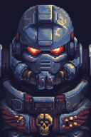<br><sub>Space Marine</sub></td>
    <td align="center"><br><sub>Orkoid</sub></td>
    <td align="center"><br><sub>Tech-Priestess</sub></td>
    <td align="center">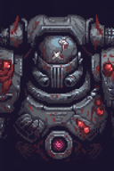<br><sub>Chaos Marine</sub></td>
    <td align="center"><br><sub>Commissar</sub></td>
    <td align="center"><br><sub>Farseer</sub></td>
    <td align="center"><br><sub>Guardsman</sub></td>
  </tr>
  <tr>
    <td align="center"><br><sub>Inquisitor</sub></td>
    <td align="center"><br><sub>Necron</sub></td>
    <td align="center"><br><sub>Skitarii</sub></td>
    <td align="center"><br><sub>Votann-Kin</sub></td>
    <td align="center"><br><sub>Tech Priest</sub></td>
    <td align="center"><br><sub>Chaos Sorcerer</sub></td>
    <td align="center"><br><sub>Navigator</sub></td>
  </tr>
</table>

---

### 🐝 The Hive

<table>
  <tr>
    <td valign="top">
      <p><strong>The Hive</strong> lets you compose sub-agents into a <strong>collective</strong> (<code>/hive</code>) run by an Overmind. Give the collective an objective, pick the participating drones, and set how many rounds of deliberation they may run. Each drone cogitates in parallel, reports back to the Overmind, and the Overmind synthesises a final answer — or asks for another round if the synthesis is incomplete.</p>
      <p>Human-in-the-loop approval gates pause the swarm before costly or irreversible actions. Everything is visualised on an SVG canvas of drone cards linked by bezier vox-lines to the Overmind, with a live timeline of what each drone is doing.</p>
    </td>
    <td align="center" width="160" valign="top">
      
    </td>
  </tr>
</table>

<p align="center">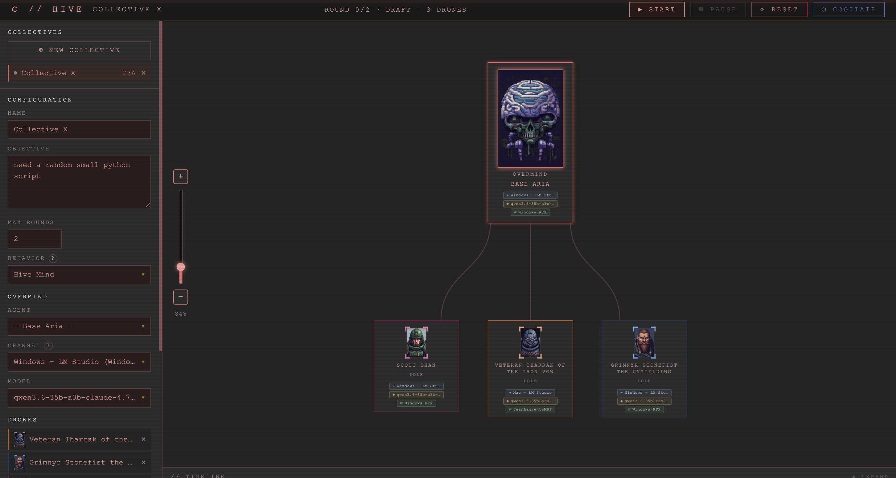<br><sub><span style="color: gray;"><em>A collective on the canvas — the Overmind and its drones, linked by bezier vox-lines</em></span></sub></p>

---

### ⏳ Vigils

Schedule autonomous directives that run even when your terminal is closed. A **vigil** books a one-hour slot on the cogitator node's cron; when the hour arrives, the agent wakes up, runs the prompt against the chosen sub-agent and model, and stores the result in the target cogitation.

- **Time-based booking** — pick a date and hour from the Vigil scheduler; the bridge node executes the job at the booked time.
- **Device pinning** — assign a vigil to a specific cogitator node so it runs on the machine that holds the right keys and files.
- **Agent selection** — run a vigil as Aria or as any custom sub-agent.
- **Resume in chat** — completed vigils append their transcript to the chosen cogitation, ready to continue when you return.
- **Fair-use limits** — 2 active vigils per soul, 2 vigils per day, 2 souls per slot.
- **Project tools opt-in** — by default vigils and Hive drones run headless with chat, web, and MCP tools only. Tick **allow project tools** when booking a vigil (or in a collective's configuration) and the run also gets the agent's file, grep, git, and bash tools — pre-authorised by the time-boxed vigil/hive grant minted at scheduling time, and still bound by the node's `Projects` toggle and Allowed Paths.

---

### 🧿 Noosphere

<table>
  <tr>
    <td align="center" width="380" valign="middle">
      
    </td>
    <td valign="top">
      <p><strong>Noosphere</strong> is Aria's bridge-local persistent memory: everything the assistant learns about you, your projects, and your preferences stays in the cogitator node's SQLite vault, not in a cloud service.</p>
      <p>The agent can <strong>Inscribe</strong> facts, <strong>Probe</strong> for recollections, and <strong>Contemplate</strong> across stored engrams to synthesise answers. Embeddings are generated by a small local model you configure, or you can rely on full-text/graph recall without embeddings.</p>
      <p>Configure extraction and embedding channels on the bridge's Memory tab, then browse stored engrams from the <code>// NOOSPHERE</code> sidebar in Aria.Web.</p>
    </td>
  </tr>
</table>

<p align="center">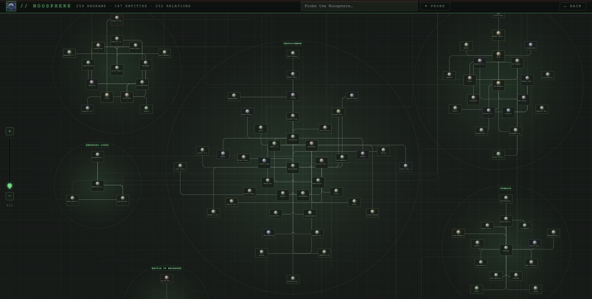<br><sub><span style="color: gray;"><em>The Noosphere view — engrams, entities, and relations mapped across the graph</em></span></sub></p>

---

### 🔒 Agent Governance and Security

<table>
  <tr>
    <td valign="top">
      <p>Pick how far the agent is trusted to act on its own (<strong>Off / Balanced / Coding / Plan / Strict / Paranoid</strong>). Each level changes how tightly the harness constrains exploration and mutation:</p>
      <ul>
        <li><strong>Off</strong> — no automatic enforcement; tools run freely.</li>
        <li><strong>Balanced</strong> — per-turn tool-call and read budgets (30 calls / 18 reads), a scope-lock to your project paths, and loop detection stop the agent wandering and burning tokens.</li>
        <li><strong>Coding</strong> — roomier budgets (60 calls / 40 reads) for real multi-file coding work; out-of-scope calls still ask for approval.</li>
        <li><strong>Plan</strong> — read-only exploration: mutations are blocked so the agent presents a plan before touching anything.</li>
        <li><strong>Strict</strong> — file writes, shell commands, deletes, and other mutations pause for in-chat approval before running.</li>
        <li><strong>Paranoid</strong> — high-stakes actions require a node-signed <strong>Inquisitorial Seal</strong> the hosted server cannot forge.</li>
      </ul>
      <p>The <code>/governance</code> chat command shows the active mode and effective budgets, switches mode, and sets per-session budget overrides (<code>/governance budget tools=&lt;n&gt; reads=&lt;n&gt;</code>, <code>budget reset</code> to clear).</p>
    </td>
    <td align="center" width="280" valign="middle">
      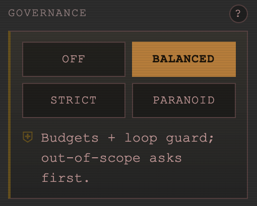
    </td>
  </tr>
</table>

<p><strong>Inquisitorial Seal.</strong> The highest-stakes operations — soul export, key rotation, PTY shell access, and (in Paranoid mode) high-stakes tool calls — are gated behind a seal that is granted locally on your cogitator node. A seal is <strong>single-use</strong> and <strong>capability-bound</strong>: the node signs the exact human-readable statement you approved, an unclaimed approval expires after <strong>5 minutes</strong>, and a consumed seal cannot be replayed or reused for a different capability. The hosted terminal cannot grant it on your behalf; only a human at the node can approve it.</p>

<p><strong>Context grant.</strong> The broader stream of sensitive server-relayed operations — provider-key spend, shell commands, the project file/git surface, MCP tool execution — is gated separately: the first such op in a session raises an approval prompt, and approving issues a node-signed <strong>context grant</strong> valid for <strong>8 hours</strong> and bound to the current browser session, so you are not re-prompted for every call. The grant expires automatically and can be revoked at any time from the bridge.</p>

<p><strong>Scope expansion.</strong> The agent's filesystem reach is the node's declared Allowed Paths — fail-closed, and the server can never widen it. When the agent legitimately needs a path outside that set, you can grant a time-boxed expansion from chat: <code>/scope add &lt;path&gt;</code> asks the node, a human approves at the node, and the node mints a signed <strong>path grant</strong> bound to the session for 8 hours. <code>/scope</code> lists the effective scope; <code>/scope remove &lt;path&gt;</code> revokes. The request only asks — the node alone grants.</p>

<p align="center">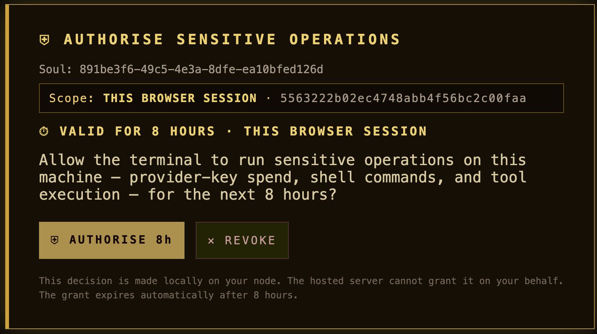</p>

<p><strong>Terminal limits.</strong> Shell and file access are gated by three independent, off-by-default toggles on the bridge — a human at the node opts into each. <strong>Agent Projects</strong> lets the agent work inside your declared projects: reading, writing and searching files, git operations, and its persistent bash shell, all scoped to the node's Allowed Paths. <strong>Quick Exec</strong> lets the user-facing web Terminal run one-shot commands, each inspected against the node's SecurityPolicy before it runs. <strong>PTY mode</strong> opens a full interactive shell, but disables the quick-exec policy because keystrokes to a live shell cannot be honestly filtered — it is gated by its own time-limited Inquisitorial Seal, which is what guarantees a human at the node consented.</p>

<p align="center">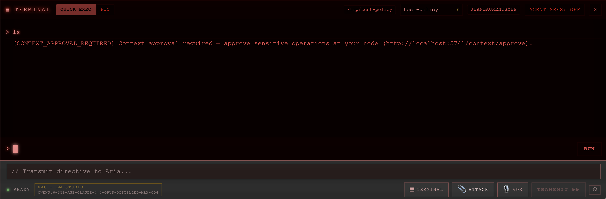</p>

---

### 🛠 Tools & Integrations

- Outlook & Gmail (read mail/calendar via OAuth)
- Web search & web-page fetch
- Persistent memory (**Noosphere**)
- Any **MCP** server you connect
- Terminal tools: Quick Exec and PTY mode (each gated by its own off-by-default node toggle; PTY also requires a seal)
- Software installs via `install_software` (allowlisted package managers: brew/npm/pip/pipx/dotnet/cargo/go/uv/yarn/pnpm/apt/choco/winget; approval-gated in every governed mode)
- Project-aware coding tools: `project_info` reads dependency files and infers exact build/run/test/install commands; `commands_index` provides static cheat-sheets as a fallback
- Coding tools: `grep`, git (`status`/`diff`/`log`/`stage`/`commit`/`discard`), `multi_edit`, `undo_file`, persistent bash with background jobs (`process_list`/`process_output`/`process_kill`), `run_background`, `wait_for`, `system_info` environment recon, `http_request` API testing, `read_image` for vision models — all scoped to the node's Allowed Paths plus any `/scope` expansions
- Agent self-management: `ask_user` (structured mid-run questions with option buttons), `context_status` (token/context pressure so the agent can wrap up before auto-compaction), `spawn_agent` delegation
- **Voice input (Vox)** — browser speech, fully on-device Whisper on your node, or cloud Whisper; audio goes straight to your node, never the server

<br>

<p align="center">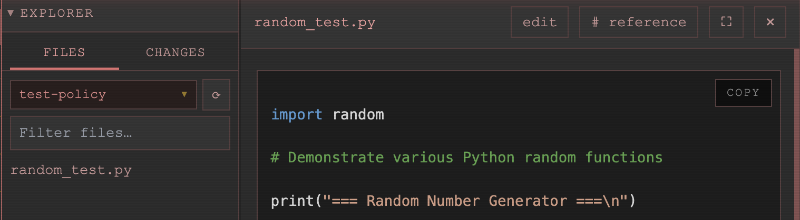<br><sub><span style="color: gray;"><em>Project explorer with server-side code highlighting</em></span></sub></p>

---

### 📇 Index

The left-menu **Index** (`/index` or `/help`) is the full catalogue of chat commands and context references. It is the same dataset that powers the inline `/` and `#` palettes, but laid out for browsing, searching, and discovering what is wired today versus what is charted for later.

- **Commands tab** — every `/` command, grouped by category (Session, Project, Capability, Dev, Aria-native), with `READY` / `PLANNED` status badges.
- **References tab** — every `#` context injection, from file paths and git state to planned symbol lookups and MCP resources.
- **Search & collapse** — filter across tokens and descriptions; groups auto-expand while you search.
- **Agent-aware** — the assistant can call `list_chat_capabilities` to see the same index and know which commands and references are available right now.

---

### ⚔ WAR.COGITATOR

<table>
  <tr>
    <td align="center" width="380" valign="middle">
      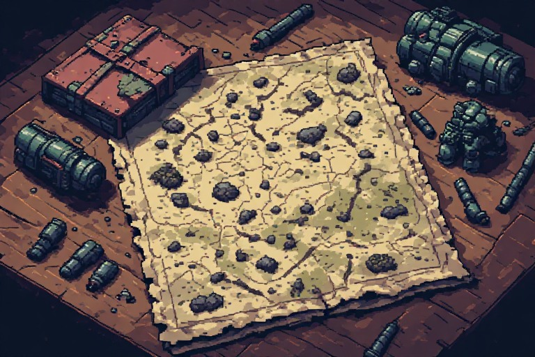
    </td>
    <td valign="top">
      <p>An AI-driven pixel-art wargame (<code>/wargame</code>) built into the terminal. Command one of four fantasy factions, manage an RTS economy, and ask the cogitator for strategic reports the agent can generate on demand.</p>
      <ul>
        <li><strong>Four factions</strong> — Empire, Greenskins, Vampire Counts, and Chaos each bring distinct units, economy, and playstyles.</li>
        <li><strong>RTS economy</strong> — harvest resources, expand territory, build structures, and muster armies on a shared tactical map.</li>
        <li><strong>Agent-driven reports</strong> — the assistant can call the strategic-report tool to analyse the battlefield, suggest moves, and narrate the unfolding campaign.</li>
        <li><strong>Persistent campaigns</strong> — game state lives in the local bridge, so you can leave and resume a war later.</li>
      </ul>
    </td>
  </tr>
</table>

---

### 🖥 Two clients, one harness

A rich terminal (`Aria.Console`, Spectre.Console) and the Blazor web UI (`Aria.Web`) both host the shared `Aria.Harness` agent-orchestration layer. The harness is host-agnostic: Web plugs in DB + SignalR bridge, Console plugs in local config + direct HTTP. The Console client is experimental — not kept up-to-date or tested; `Aria.Web` is the reference client.

Server-side markdown & code highlighting with `Markdig` + `Markdown.ColorCode` means code blocks arrive colorized and copy-ready, no extra JS CDN.

---

## ◈ Rites of Initialisation (quick setup)

You need **.NET 10**, a browser, and an LLM (local endpoint *or* a cloud API key).

### Situation 1 - The terminal is hosted locally

If you intend to run this locally (if not, CF. Situation 2), build and run both processes from `src/AriaAgent/`:

```bash
dotnet build

# 1. the cogitator node — holds your soul, history, and keys (keep it running)
dotnet run --project Aria.Bridge

# 2. the terminal
dotnet run --project Aria.Web      # then open http://localhost:5129
```

Open the bridge status page at [http://localhost:5741](http://localhost:5741) (loopback only) and follow the steps: forge your soul identity, pick a channel, set any API key (stored on your node, never on the server). Once your soul is linked, the node opens a **direct tunnel** outbound to the Aria server — model calls, key management, and MCP all route through your node with no browser tab required.

> **⚑ First node, or adding another?** On the bridge's **Soul** tab you choose one of two paths:
> - **Forge a new soul** — your first node. Generates a fresh ECDSA identity held only on this machine.
> - **Join an existing soul** — *already running a bridge elsewhere and want to interconnect your nodes?* Copy the soul ID from your existing node and paste it here; **this machine becomes an additional device of the same soul**, sharing one identity across your nodes rather than creating a second one. See **[Multi-node Routing](docs/readme/multi-node.md)**.
>
> Created a new soul but meant to join one? Go to the bridge's **Data** tab and **Wipe Soul** (this resets the identity — it also clears keys, cogitations, and the server link), then reload and choose **Join an existing soul** instead.

The fastest alternative for the node is the one-line installer:

```bash
# macOS / Linux
curl -fsSL https://raw.githubusercontent.com/jlrouzies-fr/Aria.Agent/main/scripts/install.sh | bash

# Windows (PowerShell)
# irm https://raw.githubusercontent.com/jlrouzies-fr/Aria.Agent/main/scripts/install.ps1 | iex
```

See **[Bridge Releases](docs/readme/releases.md)** for full install, update, uninstall, and release details.

> A pre-built **Docker image** is also available, but it runs the bridge in an isolated Linux container and limits host file/terminal integration. See the [Docker image](docs/readme/releases.md#docker-image) section for details and warnings.

### Situation 2 - The terminal is hosted on a hosting platform

When `Aria.Web` is deployed (see **[Fly.io Deployment](docs/readme/fly.io.md)** — one hosting example; adapt to your own platform), a layered access gate protects every page. The host hands you an **admin invite code** — configured on the server as the `GuestAccess__Codes` environment variable, in `CODE:ISO-8601-UTC-expiry` form (comma/semicolon-separated for several codes):

```bash
GuestAccess__Codes="FRIEND-CODE-1234:2026-12-31T00:00:00Z"
```

1. **Walk the Path of the Worthy** — open `https://<your-host>/access/pathoftheworthy`, present the invite code, and the gate opens for your session.
2. **Follow the bridge onboarding** — the terminal greets you with the *// BRIDGE CLIENT REQUIRED* rites: run the one-line installer for your platform to put the Aria Bridge Client on your machine.
3. **Open the bridge** — it opens its status page at [http://localhost:5741](http://localhost:5741); follow the steps to forge and link your soul. Back in the terminal, the onboarding closes by itself, the node opens its direct tunnel, and its periodic knock keeps the gate open for your network — no re-entering codes.

<table>
  <tr>
    <td width="50%">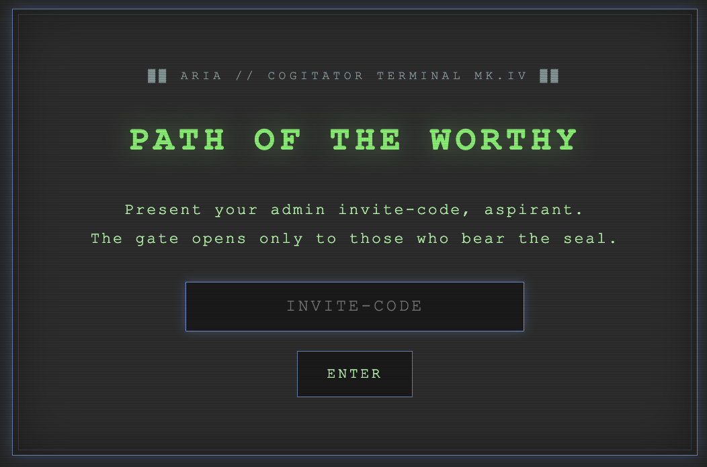</td>
    <td width="50%">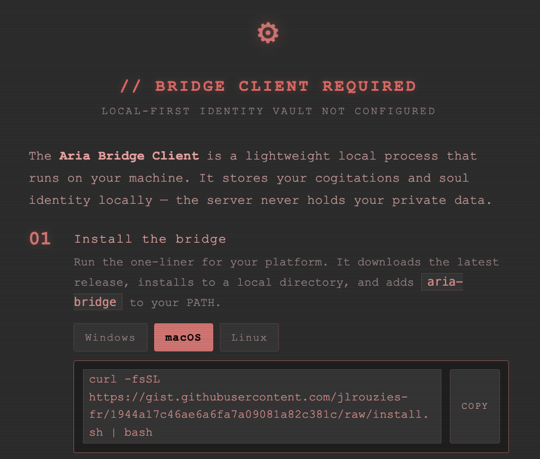</td>
  </tr>
</table>

> **Experimental:** an `Aria.Console` TUI client also exists (`dotnet run --project Aria.Console`), but it is not kept up-to-date or tested — the web terminal is the reference client.

👉 **Full setup** — Noosphere memory, OAuth for Outlook/Gmail, cloud providers, MCP servers, the wargame: **[docs/readme/setup.md](docs/readme/setup.md)**.

---

## ◈ The Archives

| Codex | Contents |
|---|---|
| **[Setup & Configuration](docs/readme/setup.md)** | <ul><li>Cogitator node</li><li>LLM channels</li><li>Noosphere memory</li><li>OAuth tools</li><li>MCP</li><li>wargame</li></ul> |
| **[Bridge Features](docs/readme/bridge-features.md)** | <ul><li>Soul identity</li><li>OAuth</li><li>Web search</li><li>MCP</li><li>LLM proxy</li><li>Telemetry</li></ul> |
| **[Bridge Releases](docs/readme/releases.md)** | <ul><li>Install scripts</li><li>Updating</li><li>Private-repo tokens</li><li>The release workflow</li></ul> |
| **[Fly.io Deployment](docs/readme/fly.io.md)** | <ul><li>Deploy `Aria.Web` to Fly.io</li><li>Layered access gate</li><li>Troubleshooting</li></ul> |
| **[Architecture](docs/readme/architecture.md)** | <ul><li>Project layout</li><li>Agent tools</li><li>The Model Bridge (direct tunnel)</li><li>Soul identity & security guarantees</li></ul> |
| **[Security](docs/readme/security.md)** | <ul><li>What each control does</li><li>What it stops</li><li>What you experience</li></ul> |
| **[Security Hardening Plan](docs/security/hardening-plan.md)** | <ul><li>Technical threat model</li><li>Findings F-1–F-9</li><li>Remediation roadmap</li><li>Verification notes</li></ul> |
| **[Multi-node Routing](docs/readme/multi-node.md)** | <ul><li>Channel↔bridge binding</li><li>Per-node key vaults + encrypted key sync</li><li>Path-routed terminal tools</li><li>Remote diagnostics</li></ul> |
| **[Agent Harness](docs/readme/harness.md)** | <ul><li>The shared `Aria.Harness` orchestration layer</li><li>How Web/Console host it</li></ul> |
| **[Reasoning Handler](docs/readme/reasoning.md)** | <ul><li>The universal SSE interceptor</li><li>Thinking + tool-call normalisation across every model</li></ul> |
| **[Code Highlighting](docs/readme/code-highlighting-plan.md)** | <ul><li>Server-side `Markdown.ColorCode` setup</li><li>CSS rules</li><li>COPY-button handling</li></ul> |

---

## ◈ Why a bridge / "the cogitator node"?

A normal hosted web app can't reach a model or files on *your* machine, and you shouldn't have to hand a stranger's server your API keys, conversations, or OAuth tokens. Aria's node inverts this: the server orchestrates, but every model call, every memory, every conversation message, and every secret flows through *your* local node. The server is a switchboard that forgets. Sensitive node data — your soul key, OAuth tokens, LLM API keys, and Terminal policy — is encrypted at rest by the OS-backed vault.

The node opens a persistent outbound SignalR connection to the server (the **direct tunnel**) — no browser tab required, works headlessly as a background service. Authentication uses ECDSA P-256 challenge-response against the soul's public key stored on the server; the terminal stays locked until the node proves it.

The same trust primitive backs the **Inquisitorial Seal**: in Paranoid governance mode a high-stakes tool call (e.g. a shell command) is paused, and a confirmation window opens *on your machine*. Only after you approve there does the node sign the server's nonce with your soul key; the server verifies that signature before the action runs. The hosted terminal cannot grant it — authorising a consequential act requires a human at the node, and no signature the server could forge will do.

The shared **Terminal** panel has two modes. **Quick Exec** is the default: each command is inspected by the bridge's `SecurityPolicy` (blocklist + allowed-project paths) before it runs. **PTY mode** is a full interactive shell on the node — vim, top, ssh, etc. — and is gated by its own Inquisitorial Seal; the grant is time-limited (10 minutes by default, tunable on the node) and can be revoked early from the bridge status page (`localhost:5741`). PTY mode disables the quick-exec policy entirely because keystrokes to a live shell cannot be honestly filtered. The seal guarantees a human at the node consented.

Shell and agent file access are opt-in per node via three independent, off-by-default toggles on the bridge ([http://localhost:5741](http://localhost:5741), Terminal / Projects): **Agent Projects** (the agent's file, grep, git, and bash tools inside your declared projects), **Quick Exec** (one-shot commands from the web Terminal), and **PTY** (the interactive shell, seal-gated as above). Enabling a tool in the web UI alone is not sufficient — the node refuses until a human at the node opts in.

See **[Architecture → Security guarantees](docs/readme/architecture.md#security-guarantees)** for exactly what's guaranteed (and the honest limits).

---

## ◈ Contacts & Soul Exchange — to be implemented

A contacts registry and soul-to-soul **exchange** rites are partially built into the terminal — the beginnings of an astropathic network. Add another soul by name and public key, send them an exchange invite (a topic and a number of deliberation rounds), and their agent cogitates with yours, each on its own node.

**Status: experimental.** The machinery exists — contacts panel, invite / accept / decline, exchange sessions — but no two souls have yet completed an exchange in the field. The rite is untested and implementation will continue; treat anything in the Contacts panel as work in progress.

---

<sub>Imperial iconography and Warhammer 40K references are the property of Games Workshop. This is an unofficial, non-commercial fan-flavoured hobby project — not endorsed by or affiliated with Games Workshop in any way. All artwork in this repository is original AI-generated fan art.</sub>
