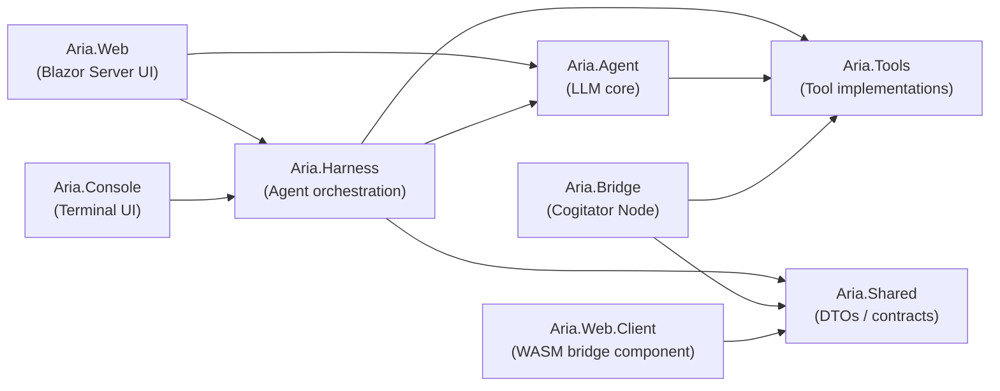
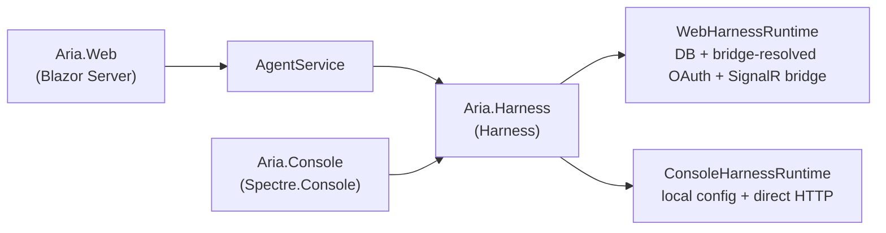
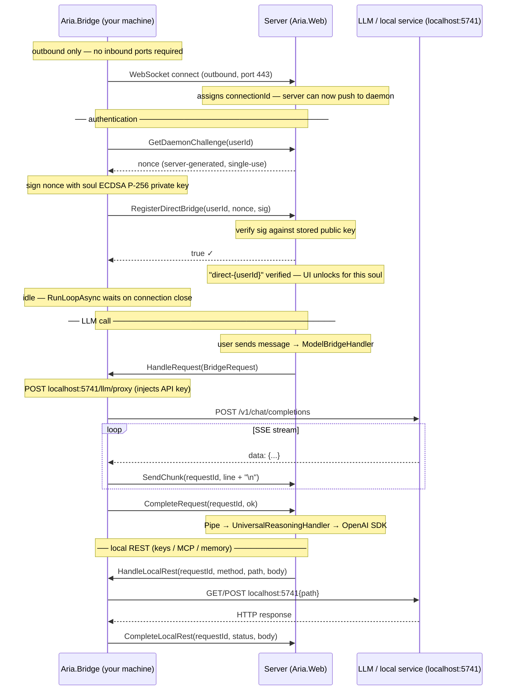
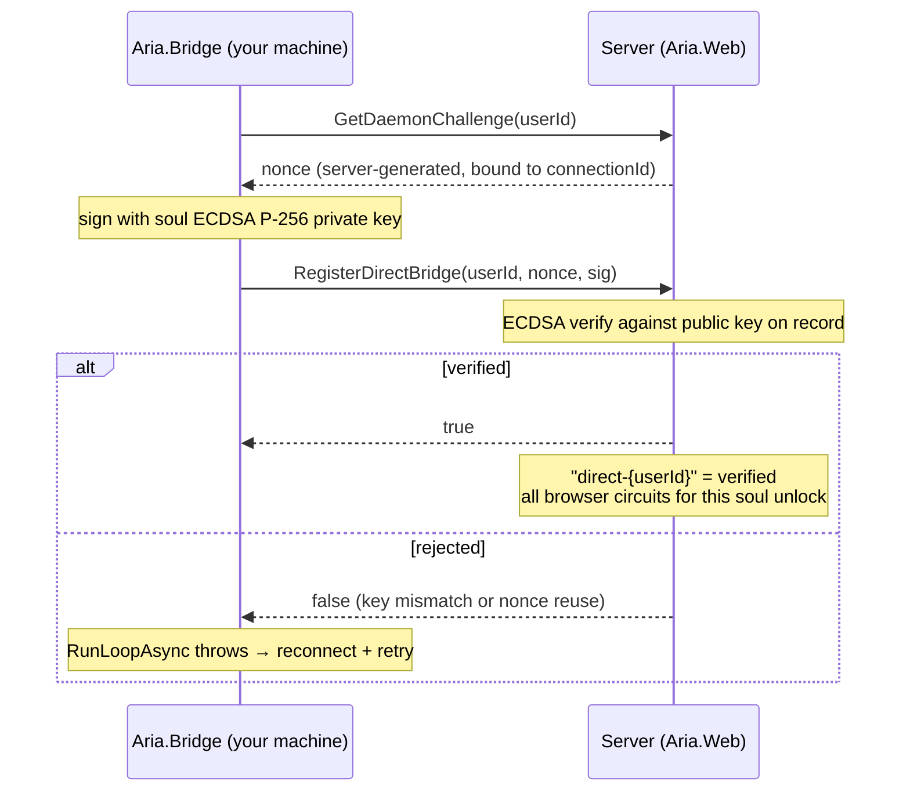

# // COGITATOR INTERNALS — Architecture

[← Back to the cogitator terminal](../../README.md)

How the machine is built: the project layout, the tools the agent wields, the **Model Bridge** (direct tunnel) that lets a hosted terminal reach your own machine, and the **soul identity** system that keeps your secrets yours.

- [Project layout](#project-layout)
- [Tools available to the agent](#tools-available-to-the-agent)
- [Model Bridge](#model-bridge)
- [Soul Identity & Bridge Authentication](#soul-identity--bridge-authentication)
- [Security guarantees](#security-guarantees)

For the SSE-stream reasoning/tool-call interception, see [Reasoning Handler](reasoning.md).

---

## Project layout

Dependencies between projects:



Full structure with key files:

| Path | Role |
|---|---|
| `src/AriaAgent/` | |
| `├── Aria.Harness/` | **Agent orchestration layer** — host-agnostic scaffold that turns a model into an agent |
| `│   ├── Core/` | `IHarness`, `Harness`, `HarnessOptions`, `HarnessContext`, `IHarnessRuntime`, `RecallScope` |
| `│   ├── Bridge/` | `BridgeMcpTool`, `BridgeToolInfo` — bridge-backed MCP tool invocation; `FanOutMemoryTool` — memory fan-out across nodes; `PathRoutedTerminalTool` — dispatches terminal calls to the node owning the path; `FileMutationToolResult` |
| `│   ├── Governance/` | `GovernedTool` session wrapper + `GovernanceContext`, `GovernancePolicy`, `ToolClassifier`, `ToolCategories`, `ToolSeverity` — per-mode budgets, scope-lock, loop detection, seals |
| `│   ├── Formats/` | `IFormatCache`, `ThinkingFormat`, `VisionSupport` — thinking/tool-call format detection |
| `│   ├── Models/` | `BridgeHttpHandler` — HTTP handler that routes LLM calls through the bridge |
| `│   └── Tools/` | `ActiveToolConfig` — lightweight enabled-tool descriptor |
| `├── Aria.Agent/` | LLM core library |
| `│   ├── ChatClientFactory.cs` | Builds OpenAI `ChatClient` from `ModelSource` config |
| `│   ├── UniversalReasoningHandler.cs` | SSE interceptor wrapper: wraps response stream in `UniversalSSEStream`; also declares `ToolCallFormat` |
| `│   ├── UniversalSSEStream/` | SSE parsing, thinking extraction, tool-call rewriting |
| `│   │   ├── UniversalSSEStream.cs` | Core `Stream` implementation: read loop, SSE line assembly, `ProcessSSELine` dispatcher |
| `│   │   ├── UniversalSSEStream.Filtering.cs` | `FilterContent` router: think/tool detection + `StripPartialOpenTagTail` |
| `│   │   ├── UniversalSSEStream.Thinking.cs` | `reasoning_content` / `<think>` handling, flush helpers |
| `│   │   ├── UniversalSSEStream.ToolCalls.cs` | Tool-call tag detection, Mistral/GLM/Kimi/Gemma parsing, `EmitRawToolCall` |
| `│   │   └── UniversalSSEStream.Rewriters.cs` | JSON content/finish_reason rewriters + `Truncate` |
| `│   ├── Configuration/` | `ModelSource` — LLM endpoint config: URL, key file, models, `IsBridged` flag; `AgentDefaults` |
| `│   ├── PublicModelSourceCatalog.cs` | Built-in public-provider catalog shared by all hosts (base URLs mirrored by `Aria.Shared.PublicProviderCatalog`) |
| `│   ├── PrefixedStream.cs` | Stream wrapper that replays prefixed bytes before the inner stream (error peeking) |
| `│   └── Obsolete/` | Legacy reasoning handlers (Foundry Local, early OpenAI) kept for reference |
| `├── Aria.Shared/` | Pure C# DTOs shared between server and daemon |
| `│   ├── BridgeRequest.cs` | Envelopes sent over SignalR: LLM calls + `LocalRestRequest` (key / MCP / memory REST via tunnel) |
| `│   ├── FormatProber.cs` | Raw HTTP probes for thinking + tool-call format detection |
| `│   ├── PublicProviderCatalog.cs` | Node-side egress source of truth for public-provider base URLs |
| `│   ├── NodeCrypto.cs` | ECDSA P-256 sign/verify helpers (soul key operations) |
| `│   ├── SealStatement.cs` / `GrantCanonical.cs` | Canonical bytes for the Inquisitorial Seal + signed-grant ceremonies |
| `│   ├── SyncModels.cs` / `SyncCrypto.cs` | Config-sync snapshot DTOs + DEK encryption for mesh replication |
| `│   ├── RequestClassifier.cs` / `TunnelAllowlist.cs` | Tunnel request classification + allowlist |
| `│   ├── BridgeMetrics.cs` | Bridge performance-metric DTOs (status dashboard telemetry) |
| `│   ├── SoulNodeRosterEntry.cs` | Multi-node roster entry (soul ↔ node bindings) |
| `│   └── ContextApprovalRequiredException.cs` | Raised when a tool call needs node-side context approval |
| `├── Aria.Tools/` | All agent tool implementations |
| `│   ├── GraphTools.cs` | Entry point / marker for partial class |
| `│   ├── GraphTools.Core.cs` | MSAL client init, `SetTokenOverride`, `EnsureAuthenticatedAsync` |
| `│   ├── GraphTools.Email.cs` | `GetFirstEmail`, `GetEmailsWithFilters`, `ListMailboxFolders` |
| `│   ├── GraphTools.Calendar.cs` | `GetCalendarEvents` |
| `│   ├── GoogleTools.cs` | Gmail + Google Calendar (OAuth broker) |
| `│   ├── DateTimeTools.cs` | `GetCurrentDateTime` |
| `│   ├── WebSearchTools.cs` | `SearchWeb` + `FetchWebPage` |
| `│   ├── TodoTools.cs` | `update_task_manifest` live checklist |
| `│   ├── WargameTools.cs` | `GetWarSituationReport` |
| `│   ├── ChatCapabilitiesTools.cs` | `list_chat_capabilities` — answers "how do I do X" from the UI command catalog |
| `│   └── McpTools.cs` | Dynamic tools from all connected MCP servers |
| `├── Aria.Bridge/` | **Cogitator node** — standalone daemon at `localhost:5741` |
| `│   ├── Program.cs` | Daemon bootstrap: wire services, pipeline, DB init, endpoints |
| `│   ├── Infrastructure/` | Daemon plumbing |
| `│   │   ├── DirectTunnel.cs` | `IHostedService`: outbound SignalR → Aria.Web; auth + request handling |
| `│   │   ├── BridgeServiceRegistration.cs` | Register loopback host, CORS, `SessionStore`, `DirectTunnel`, SQLite |
| `│   │   ├── BridgePipeline.cs` | CORS + Private Network Access preflight middleware |
| `│   │   ├── LocalOriginMiddleware.cs` / `LocalRequestGuard.cs` | Loopback-only enforcement for local surfaces |
| `│   │   ├── BridgeDatabaseInitializer.cs` | SQLite vault creation + incremental schema migrations |
| `│   │   ├── ContextGrantStore.cs` / `GrantCrypto.cs` | Context-grant persistence + crypto |
| `│   │   ├── PtySessionStore.cs` | Live PTY sessions for the web terminal |
| `│   │   └── BridgeLifetimeEvents.cs` | Application-started logging + browser launch |
| `│   ├── Data/` | `BridgeDbContext` (EF vault), `SessionStore` (live stdio MCP processes; 10-min idle eviction) |
| `│   ├── Models/BridgeModels.cs` | Bridge-internal shared models |
| `│   ├── Security/` | `SecurityPolicy`, `NodeTerminalPolicy` — node-side capability policy |
| `│   ├── BuiltinTools/` | Built-in shell/file/web/memory virtual MCP tools |
| `│   │   ├── BuiltinTools.cs` | Dispatcher, manifest aggregator, shared helpers |
| `│   │   ├── BuiltinTools.Shell.cs` | bash_exec implementation |
| `│   │   ├── BuiltinTools.File.cs` | read/write/edit/list/glob file tools (+ `DiffTools.cs`) |
| `│   │   ├── BuiltinTools.Web.cs` | Node-side web search / fetch |
| `│   │   ├── BuiltinTools.Screenshot.cs` | Headless capture of localhost pages |
| `│   │   ├── BuiltinTools.CommandsIndex.cs` | commands_index knowledge base |
| `│   │   ├── BuiltinTools.RunTests.cs` | run_tests builtin (+ `TestOutputParsers.cs`: per-ecosystem output parsers) |
| `│   │   └── BuiltinTools.Memory.cs` | Persistent memory via Noosphere (bridge-local SQLite + vector search) |
| `│   ├── Services/` | Feature services |
| `│   │   ├── Logging/BridgeLogger.cs` | In-memory + file logging, version, uptime anchor |
| `│   │   ├── Speech/LocalWhisperService.cs` | On-device `whisper.cpp` (Whisper.net): model download/cache + transcription |
| `│   │   ├── Auth/BridgeOAuthConfig.cs` | OAuth app-credential config (Microsoft / Google) |
| `│   │   ├── Llm/LlmKeyStore.cs` | Cloud API key storage |
| `│   │   ├── Diagnostics/EgressLog.cs` | Ring buffer of recent LLM egress (`/debug/llm-log`) |
| `│   │   ├── Metrics/` | `BridgeMetricsCollector`, `BridgeMetricsHostedService`, `PowermetricsTelemetrySource` |
| `│   │   ├── Noosphere/` | Memory engine: `NoosphereService`, embedder, extractor, ingest worker, config, channel resolver, capabilities, options, `NoosphereBuiltinRuntime` (opt-in MiniLM ONNX + Qwen2.5 Instruct GGUF) |
| `│   │   ├── Security/SecurityAuditLog.cs` | Node security audit trail |
| `│   │   ├── Trust/SiblingRoster.cs` | Sibling-node trust roster (multi-node mesh) |
| `│   │   └── Vault/` | F-7 value encryption: `VaultEncryption`, `AesGcmHelper`, `EncryptedValueConverter`, per-OS protectors (DPAPI / Keychain / Secret Service) |
| `│   ├── Frontend/BridgeStatusPage/` | HTML/CSS/JS for the `localhost:5741/` status dashboard — partials per tab: Overview, Channels, Data, Endpoints, Logs, Mcp, Memory, Oauth, Security, Shell, Soul, Telemetry, Terminal (+ `ScriptCommon`) |
| `│   └── Endpoints/` | |
| `│       ├── EndpointsMapper.cs` | Central `MapBridgeEndpoints()` dispatcher |
| `│       ├── SoulEndpoints.cs` | Soul CRUD, keypair, `/soul/sign`, link/unlink, rotate, import/export |
| `│       ├── LlmKeyEndpoints.cs` | Cloud key storage, `/llm/proxy` streaming, `/transcribe` (cloud Whisper), `/llm/probe` |
| `│       ├── LocalWhisperEndpoints.cs` | On-device Whisper: `/transcribe/local` + model status/download/delete |
| `│       ├── ChannelEndpoints.cs` | `/channels` — node-authoritative channel CRUD |
| `│       ├── MemoryEndpoints.cs` | `/memory/*` — inscribe/probe/contemplate/synthesize + engram CRUD |
| `│       ├── MemoryBuiltinEndpoints.cs` | `/memory/builtin/*` — opt-in model download/enable (local-origin only; not tunnel-allowlisted) |
| `│       ├── McpEndpoints.cs` | `/mcps` CRUD + probe |
| `│       ├── OAuthEndpoints.cs` | `/oauth/{provider}/connect|callback`, `/oauth-config` |
| `│       ├── SealEndpoints.cs` | `/seal/*` — Inquisitorial Seal request/poll/approve/reject |
| `│       ├── ContextEndpoints.cs` | `/context/*` — context-grant approve/revoke/enforcement |
| `│       ├── TerminalEndpoints.cs` | `/terminal/*` — capability toggles, PTY, quick-exec (+ `TerminalCompletion.cs`) |
| `│       ├── GitEndpoints.cs` | `/project-git/run` — git passthrough for project context |
| `│       ├── HiveEndpoints.cs` | `/hive/*` — node-stored hive collective content |
| `│       ├── CogitationEndpoints.cs` | Local cogitation + message storage |
| `│       ├── ContactEndpoints.cs` | Local contact storage |
| `│       ├── NodeEndpoints.cs` | Node enrollment attestation, join/session codes, `/soul/join` |
| `│       ├── SoulPinEndpoints.cs` | Last join step — primary fingerprint + pin ceremony (`/soul/fingerprint`, `/soul/pin-key`); off tunnel allowlist |
| `│       ├── ToolEndpoints.cs` | MCP server `/tools/list` and `/tools/call`, plus read-only `/tools/preview` (prospective diffs) |
| `│       ├── ProjectFileEndpoints.cs` | Local project file listing + reading |
| `│       ├── StatusEndpoints.cs` | `/`, `/status`, `/logs`, `/metrics` — status dashboard + live bridge performance metrics |
| `│       ├── DbAdminEndpoints.cs` | `/db-info`, wipe cogitations/messages/soul |
| `│       ├── SyncEndpoints.cs` | `/sync/apply`, `/sync/status` — receives server-authoritative config snapshots |
| `│       └── ConsoleEndpoints.cs` | `/console/*` — local-only surface read by `Aria.Console` |
| `├── Aria.Console/` | Terminal client (Spectre.Console chat loop). Mandatory local bridge: auto-starts it, reads synced agents/tools/sources from it, and proxies LLM calls through it. Key files: `Program.cs`, `BridgeConsoleClient.cs` (HTTP client for the node), `Harness/ConsoleHarnessRuntime.cs` + `ConsoleFormatCache.cs`, `AriaMarkdownTheme.cs` / `AriaRetroChrome.cs` / `ConsoleHelper.cs` (terminal chrome) |
| `├── Aria.Tests/` | xUnit suite — `Agent/` (SSE stream), `Bridge/` (endpoints, context grants, seals, vault, policy), `Harness/` (harness smoke + `ToolClassifier`), `Shared/` (provider pinning, request classifier, tunnel allowlist), `Tools/`, `Web/` (`WebApplicationFactory` integration), `Fakes/` |
| `├── Aria.Web.Client/` | Blazor WASM island — `BridgeComponent.razor`: invisible browser-side component maintaining the SignalR link between browser and server |
| `└── Aria.Web/` | **Blazor Server web UI** — main project |
| `    ├── Program.cs` | Minimal bootstrap: config, build, service wiring, DB init, pipeline, endpoints, run |
| `    ├── DependencyInjection/` | `ServiceCollectionExtensions.AddAriaServices()` — all DI registrations; `WebApplicationExtensions` — `UseAriaPipeline()`, `WireAriaServices()`, `EnsureAriaDatabaseAsync()`, `MapAriaEndpoints()` |
| `    ├── Middleware/` | `AccessGateMiddleware` (Path of the Worthy entry gate), `SecurityHeadersMiddleware`, `PipelineExtensions` |
| `    ├── Endpoints/` | Minimal API mappers — `EndpointMapping` (central), `AccessEndpoints` (entry codes), `BridgeNodeEndpoints` (`/api/bridge/enroll-node`, `/revoke-node`, `/pending-enroll`), `SoulEndpoints` + `SoulEndpointHelpers` (register/unlink/rotation), `DeviceEndpoints` (trusted devices), `VoxEndpoints` (`/api/vox/transcribe`), `MaintenanceEndpoints`, `DebugEndpoints` (`#if DEBUG` registrations) |
| `    ├── Debugging/` | `#if DEBUG` APIs: `BridgeDebugApiEndpoints`, `ChatDebugApiEndpoints`, `CronDebugApiEndpoints`, `HiveDebugApiEndpoints`, `McpBridgeDebugApiEndpoints`, `ProjectFilesDebugApiEndpoints`, `WargameApiEndpoints` |
| `    ├── Services/` | |
| `    │   ├── AgentServices/AgentService.cs` | Web-facing **facade** over `IHarness`. Builds `HarnessOptions`/`HarnessContext` from web state and delegates session creation, streaming, and format detection to the shared harness. Keeps the original public surface for Blazor pages. |
| `    │   ├── Agent/` | `SubAgentService`, `SkillService`, `AgentBackgroundExecutor` |
| `    │   ├── Auth/` | `CircuitAuthService`, `TrustedDeviceService`, `UiAccessKnockService`, `UserService` |
| `    │   ├── Chat/` | `UserSessionState` (scoped per circuit: active soul, agent, model selection), `ChatCatalog` (`/` commands + `#` references), `MessageEntry`, `VoxService` (voice transcription routing), `ExchangeSessionService` (soul-to-soul exchange sessions) |
| `    │   ├── Cogitations/` | Cogitation persistence + background-run hosting |
| `    │   │   ├── CogitationService.cs` | EF Core CRUD for cogitation metadata + legacy/server-stored messages |
| `    │   │   ├── CogitationFolderService.cs` | Cogitation folder organisation |
| `    │   │   ├── BridgeCogitationClient.cs` | REST client for bridge-owned (node-stored) cogitation content |
| `    │   │   ├── CogitationRunRegistry.cs` | Singleton: hosts a cogitation's turn as a background run, independent of any Blazor circuit — survives navigation, cogitation switch, and page refresh; multiple can run concurrently |
| `    │   │   ├── CogitationRun.cs` | Per-run state: adopted agent/session/router, thread-safe reply mutation, in-run approval gate |
| `    │   │   ├── CogitationRunRequest.cs` | Everything `StartRun` needs to run one turn detached from the component that started it |
| `    │   │   ├── CogitationStreamRouter.cs` | Retargetable indirection between the agent's tool callbacks (bound at construction) and whoever's currently consuming the stream — the component or the background run |
| `    │   │   └── StreamingErrorHelper.cs` | Shared cancellation-detection / friendly-error formatting (greeting stream + registry) |
| `    │   ├── Collective/` | `CollectiveService` (hive CRUD), `BridgeHiveClient` (node-stored hive content) |
| `    │   ├── CollectiveOrchestrator/` | Multi-agent execution engine, split into partials: `.cs` (fields, events, constructor, `IHostedService`, public API, gate management), `.Conditions`, `.Cogitation`, `.Loop`, `.Phases`, `.DbHelpers` |
| `    │   ├── Cron/` | `CronSlotService` (scheduled vigils), `CronSchedulerHostedService` |
| `    │   ├── Llm/` | `WebHarnessRuntime` (web `IHarnessRuntime`: sources, keys, OAuth via bridge, SignalR bridge requests), `WebFormatCache` (SQLite-backed `IFormatCache`, `ModelFormatCaches` table), `UserLocalSourceService` |
| `    │   ├── Memory/` | `BridgeMemoryClient` (Noosphere REST via tunnel), `AutoMemoryMode`, `MemoryGraphLayout` (memory page graph layout) |
| `    │   ├── ModelBridge/` | Direct-tunnel server side |
| `    │   │   ├── ModelBridgeHub.cs` | SignalR: `GetDaemonChallenge`, `RegisterDirectBridge`, `SendChunk`… |
| `    │   │   ├── ModelBridgeRegistry.cs` | `connId → userId`; soul-verified state; node lifecycle |
| `    │   │   ├── ModelBridgeRegistry.Routing.cs` | `SendRequestAsync`, `SendLocalRestAsync`, stream chunks/completion |
| `    │   │   ├── ModelBridgeHandler.cs` | `HttpMessageHandler`: AI calls through bridge (Pipe-backed stream) |
| `    │   │   ├── BridgeChannelClient.cs` | Node-authoritative channel list (read-only server mirror) |
| `    │   │   ├── BridgeSyncService.cs` | Builds + pushes config snapshots to nodes (`/sync/apply`) |
| `    │   │   ├── GrantService.cs` | Mints node-signed grants via the Seal ceremony over the tunnel |
| `    │   │   ├── GrantReplicationService.cs` (+ `GrantReplicationBackgroundService`) | DEK-encrypted grant replication across sibling nodes |
| `    │   │   ├── SealService.cs` / `ContextApprovalService.cs` | Seal ceremony + context approvals over the tunnel |
| `    │   │   ├── TerminalClient.cs` / `TerminalPtyService.cs` | Web terminal (quick-exec + PTY) over the tunnel |
| `    │   │   ├── BridgeMetricsClient.cs` / `ProjectFilesClient.cs` / `BridgeToolFunction.cs` | Node metrics, project files, bridge tool adapter |
| `    │   ├── Node/` | `NodeService` (list/enroll/revoke/channel pinning), `PendingEnrollmentService`, `SignedGrant` |
| `    │   ├── Tool/` | `ToolRegistry`, `UserToolService`, `UserMcpService`, `BridgeMcpClient` |
| `    │   └── WargameService/` | WAR.COGITATOR — AI-driven pixel-art wargame engine: `.State` (game state, lifecycle, refresh), `.Economy` (turn loop, income, actions), `.Ai` (LLM client, parsing, situation report), `WargameMapGenerator` |
| `    ├── Data/` | EF Core SQLite (`AppDbContext` in `Data/Context/`): `Users/`, `Agents/`, `Cogitations/`, `Collectives/`, `Bridge/`, `Llm/`, `Wargame/`, `TrustedDevice.cs`, `UiAccessKnock.cs`, `DatabaseInitializer.cs` |
| `    ├── Helpers/` | `AgentSprites.cs` (avatar rendering) + `AgentSprites.Sprites.cs` (16×16 pixel-art data), `AgentPersona`, `MarkdownHelper`, `ClientIpResolver` |
| `    ├── Components/` | |
| `    │   ├── App.razor` / `Routes.razor` | Root: global `InteractiveServer` `<Routes>` — no `@rendermode` on children |
| `    │   ├── Layout/` | |
| `    │   │   ├── MainLayout.razor` / `NavMenu.razor` | Shell + left sidebar: nav items + flyout panel host |
| `    │   │   ├── NavMenu.razor.cs` | Core: injects, lifecycle, user/model selection, cogitations, panel toggles |
| `    │   │   ├── NavMenu.*.razor.cs` partials | `.Bridge` (soul verification, bridge events, session-code unlock), `.Agents` (sub-agent CRUD + skills editor), `.Tools` (tool toggles/modals, OAuth status, MCP servers), `.Channels` (local sources, provider keys, vox, model selection), `.Contacts` (contacts, exchange invites, devices, hive collectives), `.Cogitations`, `.Memory` |
| `    │   │   ├── NavMenu*Panel.razor` | Flyout panels: `Souls`, `Cogitations` (per-row run spinner + unseen dot), `Channel` (+ local-source/API-key modals), `Devices` (bridge nodes + pending approvals), `Agents`, `Skills`, `Hive`, `Tools`, `Reference` (`/` + `#` INDEX) |
| `    │   │   └── Modals + chrome` | `BridgeGatewayModal` (onboarding when daemon offline), `HeaderSoul` (soul + verified light), `BridgeVersionIndicator`, `ApprovalNodePicker`, `ReconnectModal`, `NavMenuVigilScheduler` (full-screen vigil scheduler) |
| `    │   ├── Pages/` | |
| `    │   │   ├── Chat.razor` + partials | Main chat interface — `.razor.cs` (fields, lifecycle, session/bridge events, soul verify/unlock, background-run attach), `.Session`, `.Messaging` (turns delegated to `CogitationRunRegistry`), `.Rendering`, `.Approval`, `.Explorer`, `.FilePicker`, `.FormatDetect`, `.HiveGate`, `.Tabs`, `.Terminal`, `.Vox` |
| `    │   │   ├── Home.razor` | Landing page |
| `    │   │   ├── Memory.razor` (+ `.cs`, `MemoryCanvas.razor`) | Noosphere memory page + graph canvas |
| `    │   │   ├── Exchange.razor` | Soul-to-soul exchange page |
| `    │   │   ├── Hive.razor` + partials | Hive page — `.razor.cs` (state, CRUD, orchestration controls), `.Canvas`, `.Config`, `.Members`, `.Cogitation` + child components `HiveSidebar`, `HiveCanvas`, `HiveTimeline`, `HiveOvermindDrawer`, `HiveDroneDrawer` |
| `    │   │   ├── Wargame.razor` + children | WAR.PLANNER shell + `WargameMap` (canvas), `WargameFactionPanel`, `WargameLog` |
| `    │   │   └── Error / NotFound / Counter` | Error + 404 pages (`Counter` is template scaffolding) |
| `    │   └── Shared/` | Reusable components: `DebouncedInput` / `DebouncedTextArea` (+ `DebouncedInputBase`), `CronSchedulerPanel` (+ `CronScheduleView` / `CronVigilsView`), `ChangesRow`, `DiffCard`, `ExplorerTreeView`, `ThemedSelect` |
| `    └── wwwroot/` | |
| `        ├── app.css` + `css/<feature>/` | All styling — modular per-feature stylesheets under `css/` (`theme`, `layout`, `sidebar`, `chat`, `hive`, `memory`, `vigil`, `warplanner`…), CSS custom properties throughout |
| `        ├── aria-interop.js` + `js/wargame-renderer.js` | JS interop: scroll, theme, sidebar, hive canvas init; wargame canvas renderer |
| `        ├── avatars/` | Pixel-art + portrait avatar sets |
| `        └── lib/`, `vox-recorder-worklet.js`, icons | xterm.js bundle (web terminal), vox audio capture worklet, `favicon.png` / `logo.png` |

> **Render modes:** global `InteractiveServer` on `<Routes>` in `App.razor` — the whole app is one persistent circuit. Don't add `@rendermode` to individual pages.

> **DB note:** `AppDbContext` uses `EnsureCreatedAsync()` at startup (no `__EFMigrationsHistory`). A `Migrations/` folder also exists; the two approaches are mutually exclusive — reconcile the history table by hand before using `dotnet ef database update`.

---

## Agent Harness

The agentic orchestration logic that used to live inside `Aria.Web.Services.AgentService` has been extracted into a shared `Aria.Harness` class library. Both `Aria.Web` and `Aria.Console` now host the same harness and only supply host-specific runtime adapters.

### Why a separate harness?

- **One core, multiple UIs.** The Blazor web UI and the terminal client share chat-client construction, tool assembly, reasoning normalisation, format detection, and streaming — but they resolve users, keys, and bridge access very differently.
- **Host-agnostic domain.** `Aria.Harness` has no dependency on Blazor, SignalR, EF Core, or Spectre.Console. It defines narrow runtime contracts (`IHarnessRuntime`) that each host implements.
- **Testability.** A smoke-test project (`Aria.Tests`) can spin up the harness with stub runtimes and exercise real format detection through a `WebApplicationFactory`.

### Key abstractions

| Contract | Responsibility |
|---|---|
| `IHarness` | Main entry point: `CreateSessionAsync`, `StreamAsync`, `DetectThinkingFormatAsync`, `DetectToolCallFormatAsync`, `ForceRedetectAsync`, `ResolveContextWindowAsync`. |
| `IHarnessRuntime` | Host-provided capabilities: resolve sources / API keys / OAuth tokens, check bridge availability, post/stream through the bridge, and access the `IFormatCache`. |
| `HarnessOptions` | Host-agnostic session config: selected source/model, thinking format, enabled tools, MCP servers, callbacks for thinking/tool progress. |
| `HarnessContext` | Per-operation context: `UserId`, `BridgeUserId`, resolved `ContextWindow`, cancellation token. Deliberately small — heavy state lives in the runtime. |
| `IFormatCache` | Thinking/tool-call format cache abstraction, now also stores per-source+model `ContextWindow`. Web uses SQLite (`WebFormatCache`); Console uses in-memory (`ConsoleFormatCache`). |
| `ContextWindow` | A discovered or configured context-window size (`Tokens`, `Assumed`). Used to derive auto-compaction thresholds, populate `context_status`, and guard oversized `read_file` calls. |

### Host adapters



- **`WebHarnessRuntime`** (`Aria.Web/Services/Llm/WebHarnessRuntime.cs`)
  - Resolves model sources from `UserLocalSourceService` plus the built-in public-provider catalog.
  - Loads cloud API keys from `AppDbContext.UserLlmApiKeys`.
  - Resolves OAuth tokens by calling the bridge (`/oauth/{provider}/token`); tokens live on the node, not the server.
  - Routes bridge calls through `ModelBridgeRegistry` (SignalR direct tunnel).
  - Uses `WebFormatCache` backed by `ModelFormatCaches`.

- **`ConsoleHarnessRuntime`** (`Aria.Console/Harness/ConsoleHarnessRuntime.cs`)
  - Talks to the mandatory local bridge over HTTP ([http://localhost:5741](http://localhost:5741)).
  - Loads synced local sources from `/console/sources` and merges them with the shared public-provider catalog.
  - Cloud API keys live on the bridge; the console only checks key presence via `/keys`.
  - Pre-seeds OAuth tokens when MSAL/Google desktop auth succeeds.
  - Proxies all LLM calls through `/llm/proxy` on the bridge.
  - Uses `ConsoleFormatCache` (in-memory, no persistence).

### From monolith to facade

`Aria.Web.Services.AgentService` is now a thin web facade:

- It still exposes the same public methods used by Blazor pages (`CreateSessionAsync`, `StreamAsync`, `DetectThinkingFormatAsync`, etc.).
- Internally it maps web state (`userId`, `bridgeUserId`, enabled tools, MCP servers) into `HarnessOptions`/`HarnessContext` and delegates to `IHarness`.
- Web-specific data access moved into `WebHarnessRuntime`, so the harness itself has no knowledge of EF Core or SignalR.

### Context window discovery

Every model has a context-window budget. Aria resolves it per source+model with this precedence:

1. **User override** — an optional `ContextWindow` value on the bridge channel configuration (`BridgeChannel.ContextWindow`), surfaced on the bridge status page.
2. **Provider discovery** — the bridge's `/llm/detect-format` endpoint probes local endpoints (Ollama `/api/show` first, then OpenAI-compatible `/models/{id}`) and returns the discovered size, which the harness stores in `IFormatCache`.
3. **Well-known cloud catalog** — `ContextWindowCatalog` maps common public model ids (GPT-4o, Claude 3.5 Sonnet, Gemini 1.5 Pro, etc.).
4. **Assumed fallback** — `100_000` tokens, explicitly marked `Assumed = true` so it preserves today's behaviour.

A *known* window changes three things:

- **Auto-compaction threshold** becomes `window × 0.8`, clamped to a 4k floor (`AutoCompaction.ResolveThreshold`).
- **`context_status`** reports the window, estimated % used, and whether it is known or assumed (`ContextStatusReport`).
- **`read_file` guard** — when a file is estimated to exceed 25% of a known window, the bridge returns the first ~200 lines plus guidance to read ranges (`BuiltinTools.ReadFile`).

Assumed windows keep the legacy 100k threshold and leave `read_file` uncapped, so existing sessions are unaffected until a model is re-probed or an override is set.

### Tests

`Aria.Tests` covers the harness, the bridge, and the shared contracts with both in-memory stubs and real infrastructure:

- `Harness/HarnessTests` — harness smoke tests using `ConsoleHarnessRuntime` and the public-provider catalog.
- `Web/IntegrationTests` — `WebApplicationFactory` tests for debug endpoints (`/api/debug/chat/*`, `/api/debug/mcp-bridge/*`).
- `Web/LocalLmIntegrationTests` — reads the real local source from `Aria.Web/aria.db`, seeds an isolated test database, and exercises actual thinking/tool-call format detection.
- `Web/AccessGateTests`, `Web/TrustedDeviceGateTests`, `Web/SignedGrantTests` — entry-gate, device-trust, and signed-grant flows.
- `Bridge/*` — endpoint and policy tests: context grants, seals, soul export ceremony, vault encryption, local-origin guard, security audit log, terminal node config.
- `Agent/UniversalSSEStreamTests`, `Harness/ToolClassifierTests`, `Shared/*`, `Tools/*` — SSE filtering, governance classification, and shared-contract pinning.

---

## Console/Bridge config sync

`Aria.Console` does not keep its own copy of agents, tools, sources, or MCP servers. Instead, `Aria.Web` remains the authoritative UI/DB and pushes a plaintext snapshot to each connected bridge whenever config changes:

```
Aria.Web  ──SignalR direct tunnel──►  Aria.Bridge  ──local HTTP──►  Aria.Console
   │                                       │                              │
   │  user edits agent/tool/source/MCP     │  /sync/apply                 │  /console/*
   └──────────────────────────────────────►│  mirrored tables             │  pickers + LLM proxy
```

- Server-side `BridgeSyncService` builds a `SyncSnapshot` from `SubAgent`, `UserToolConfig`, `UserLocalSource`, `UserMcpServer`, and `UserLlmApiKey` rows.
- It calls the bridge over the existing authenticated tunnel (`ModelBridgeRegistry.SendLocalRestAsync`) to `POST /sync/apply`.
- `Aria.Bridge` wipes its mirrored tables (`SyncedSubAgents`, `SyncedToolConfigs`, `SyncedLocalSources`, `SyncedMcpServers`) and rewrites them, then overwrites `LlmKeys` with the server-provided cloud keys.
- A snapshot is also pushed automatically when a bridge reconnects (`DirectBridgeRegistered`).
- `Aria.Console` reads the mirror through `/console/profile`, `/console/agents`, `/console/tools`, `/console/sources`, and `/console/mcps`.

This means a user who sets up agents and channels in the web UI can open the terminal and use them immediately, without re-declaring anything.

---

## Tools available to the agent

| Tool | Source | Description |
|------|--------|-------------|
| `GetCurrentDateTime` | DateTimeTools | Returns the current date and time |
| `SearchWeb` | WebSearchTools | Ollama-powered web search |
| `FetchWebPage` | WebSearchTools | Fetches and strips the text content of any URL (20,000 char limit) |
| `GetFirstEmail` | GraphTools | Fetches the most recent Microsoft email |
| `GetEmailsWithFilters` | GraphTools | OData-filtered Microsoft email search |
| `ListMailboxFolders` | GraphTools | Lists Outlook mailbox folder tree with counts |
| `GetCalendarEvents` | GraphTools | Fetches Outlook calendar events in a date range |
| `GetGmailEmails` | GoogleTools | Gmail search with subject/from/to/label/date filters |
| `ListGmailLabels` | GoogleTools | Lists Gmail labels |
| `GetGoogleCalendarEvents` | GoogleTools | Fetches Google Calendar events in a date range |
| `ListGoogleCalendars` | GoogleTools | Lists available Google Calendars with IDs |
| `Inscribe` | BuiltinTools.Memory | Commits a fact to the memory bank (fire-and-forget) |
| `Probe` | BuiltinTools.Memory | Queries the memory bank by question |
| `Contemplate` | BuiltinTools.Memory | Synthesises reasoning across all memory |
| `GetWarSituationReport` | WargameTools | Strategic report: turn, factions, units, resources, buildings, battle log |
| `update_task_manifest` | TodoTools | Posts/updates the agent's live task checklist (pinned in the UI) |
| `list_chat_capabilities` | ChatCapabilitiesTools | Lists the UI's `/` commands and `#` context references, so the agent can answer "how do I do X" questions |
| `run_tests` | BuiltinTools.RunTests | Structured build/test/lint runs: infers the project command (or takes an explicit one), maps a filter to the native flag, parses dotnet/pytest/jest/vitest/cargo/go output into counts + failing tests with file:line; bash_exec's governance class |
| *(dynamic)* | McpTools | All tools exposed by enabled MCP servers |

### Governance wrapper

Every tool above is wrapped at session-build time by a `GovernedTool` (`Aria.Harness/Governance/`) — invisible to the model (name/description/schema delegate to the inner tool). Before a call runs, a per-session `GovernanceContext` + `ToolClassifier` apply the active mode's policy: per-turn tool-call/read budgets, a scope-lock to the active project paths plus `#`-referenced files, and loop detection. A refused call returns a **synthetic result** the model self-corrects on (never a throw), a gated call pauses for an in-chat approval, and a high-stakes call in Paranoid mode escalates to the node-signed **Inquisitorial Seal** (see [Security guarantees](#security-guarantees)). The mode is re-read each turn, so changes apply to an existing chat on the next message. When a file mutation (`edit_file`/`multi_edit`/`write_file`) pauses for approval, the harness fetches a **prospective diff** from the bridge's read-only `POST /tools/preview` endpoint and the approval card renders it; after the mutation the same diff is appended to the model-facing result text (bridge `AgentTools:DiffFeedback` knob, on by default).

After a successful file mutation (`write_file`/`edit_file`/`multi_edit`/`delete_*`/`move_path`/`create_dir`), the wrapper also counts it against the turn's **verify nudge**: while no build/test verification has run, the mutation's own result earns a one-line reminder — at the first mutation, then every five — `◈ N file(s) mutated this turn, no build/test run yet — consider verifying (run_tests, or project_info to infer the command).` A PASSED `run_tests` (recognised by its structured `◈ TEST RUN … — PASSED` header) or a `bash_exec` command matching the build/test pattern list (`dotnet test|build`, `pytest`, `npm test|run build`, `cargo test`, `go test`, `make test`) marks the turn verified and silences it; both counters reset in `BeginTurn`. Advisory only — never blocks, never fails a call, never counts against budgets (`Governance:VerifyNudge` knob, on by default). Success/failure comes from the bridge's own `ToolCallResponse.IsError` flag, surfaced harness-side on the result wrappers (`BridgeToolResult`, `FileMutationToolResult.IsError`) — bridge error texts have no uniform prefix.

---

## Model Bridge

When Aria is hosted on a remote server, the server cannot reach a model on a user's own machine (`localhost:1234`, a LAN box, etc.). The bridge reverses the direction: the local cogitator node (`Aria.Bridge`) makes the actual outbound HTTP calls, and the results stream back to the server. Every model/memory call exits from the user's own machine — no browser tab required.

### How the server can push to a node it can't dial

The daemon is behind NAT — inbound connections are impossible. The trick: a **WebSocket is bidirectional**. Once the daemon opens one outbound connection, either side can write at any time. The server uses `IHubContext<ModelBridgeHub>` to push by `connectionId`; the daemon's registered `hub.On<T>()` handlers fire when those pushes arrive. No inbound port needed.

`DirectTunnel` is an `IHostedService` inside `Aria.Bridge`. It opens the connection, authenticates, then idles. `RunLoopAsync` reconnects with exponential backoff on drop and re-authenticates automatically.



- **Transparent to the agent framework.** `ModelBridgeHandler` is the `InnerHandler` of `UniversalReasoningHandler`; the OpenAI SDK and tool loop are unchanged.
- **Streaming preserved.** `System.IO.Pipelines` reconstructs the SSE stream server-side from the `SendChunk` messages, so the SDK receives a normal `Stream`.
- **Single egress through the node.** Local models, cloud providers, memory, key management, and MCP all exit via the node — no CORS required on the model server; LAN-HTTP models work under HTTPS hosting.
- **Request isolation.** `ModelBridgeRegistry` maps `connectionId → userId` and tracks pending requests by `RequestId`; each `Channel<string>` routes chunks back to the right `Pipe`.
- **Upstream errors are surfaced, not swallowed.** The tunnel relays failures as `200 text/event-stream` (the transport can't change status mid-stream); `UniversalReasoningHandler` peeks the first bytes of every chat stream and turns a JSON `{"error":…}` body into a thrown fault the chat renders (`// COGITATOR FAULT: The model endpoint rejected the request: … //`). Each bridge also keeps a ring buffer of its recent LLM egress at `GET /debug/llm-log`.

### Multiple nodes per soul

One soul can have bridges on several machines. All routing is by **explicit binding**, never by
which machine the browser is on: channels bind to a node (chat, probes, and key custody follow
that binding), provider keys live in per-node vaults and mesh-replicate as DEK-encrypted blobs the
server can't read, and terminal tools dispatch each call to the node owning the path argument.
Full rules, failure modes, and the diagnostic endpoints: **[Multi-node routing](multi-node.md)**.

---

## Soul Identity & Bridge Authentication

A **soul** is a user identity whose **ECDSA P-256 keypair is generated and stored only by the local cogitator node** (`aria-bridge`) — the private key never leaves `localhost`. The server stores only the public key (registered via the node's `link-server` call).

Authentication is performed once at daemon connection time (detailed flow: [Model Bridge](#model-bridge)):



- **Locked by default.** Until verification passes, the UI shows the onboarding modal and hides all soul-scoped data. A green pulsing light = daemon connected & verified; orange = daemon unavailable.
- **Auto re-lock.** When the daemon disconnects `ModelBridgeRegistry.Unregister` clears `"direct-{userId}"` immediately — no heartbeat delay.

Relevant code: `ModelBridgeRegistry.IsSoulVerified / SetSoulVerified`, `DirectTunnel.cs` (daemon ECDSA auth), `NavMenu.Bridge.cs` (NavMenu side-effects), `BridgeGatewayModal.razor` (onboarding), `SoulEndpoints.cs` (`/soul/sign`).

---

## Security guarantees

What the design guarantees, and the honest limits:

| ✅ Guarantee | How |
|---|---|
| **No secrets leave the user's machine** | The soul keypair, cloud-provider API keys, OAuth app credentials, and OAuth tokens live only on the cogitator node (`localhost:5741`). The server only ever sees the soul's public key; cloud keys are injected by the node at call time and never reach the server. Even voice transcription posts audio straight to the node, so audio and the Whisper key stay local — and with on-device Whisper the transcription never leaves the machine at all. |
| **No access without proof of key possession** | A session unlocks only after the daemon signs a fresh, server-generated nonce that verifies against the stored public key (`RegisterDirectBridge`, ECDSA P-256). The `userId` claim in the challenge request grants nothing on its own. |
| **Locked by default** | Verification defaults to *false*; the UI hides all soul-scoped data and disables soul-scoped actions, with server-side guards backing the UI. |
| **Cross-soul isolation (multi-user safe)** | Verification is keyed by `"direct-{userId}"`, not a shared token — a circuit that selects a different soul cannot inherit verification from another. |
| **Replay-resistant** | Challenge nonces are server-generated, single-use, short-TTL — for both session verification and the soul-unlink flow (`/api/bridge/unlink-challenge` → sign → `unlink-soul`, nonce consumed on first use). |
| **Loopback trust anchor** | The node binds to `localhost` only, so only software on the user's own machine can reach it to sign. |
| **Auto re-lock** | When the daemon disconnects, `Unregister` clears its verified state immediately — no heartbeat delay. |
| **High-stakes acts need a human at the node (Inquisitorial Seal)** | In Paranoid governance mode, a high-stakes tool call is paused; the node shows a local approval page and signs the server's nonce with the soul key **only** after the user approves there. The server verifies the signature (`NodeCrypto.Verify`) before the call runs. The hosted server cannot self-authorise — no signature it could forge will satisfy the check. *(Primary node only — secondary nodes hold no soul private key.)* |

**Hardened (0.25.0+):**
- **Terminal capability is opt-in on the node.** The web Terminal tool toggle is no longer treated as
  authorisation to run commands. Quick Exec, PTY, and the agent's `bash_exec` are refused until a human
  enables **Terminal Capability** on the bridge status page ([http://localhost:5741](http://localhost:5741)). PTY still requires
  its own time-limited Inquisitorial Seal on top of that master toggle.
- **The tunnel speaks an allowlist, and loopback is not a human.** The node only forwards a fixed set of
  server-relayed paths (`TunnelAllowlist`); soul admin, `/db/*`, and channel/key writes are never
  tunnel-reachable. Mutating requests must be local-origin (`LocalOriginMiddleware`), which defeats
  CSRF/DNS-rebinding from a page the user merely visits. Channels and cloud keys are authored only on
  the node, and `/llm/proxy` pins the egress host from the node's own record — a compromised server can
  neither redirect a keyed call nor read a key back.
- **Layer A — browsers pass the gate on a node-approved device, not an IP.** A new browser gets an
  `aria-device` cookie marked pending; trusting it runs the Seal ceremony at any connected node, and the
  grant is verified against the soul key *or any non-revoked node key* — so revoking a node also drops
  the devices it approved. A stolen entry code or copied cookie is useless from an unapproved device.
- **Layer B — sensitive server-pushed ops need a live context grant (on by default).** The bridge
  classifies every relayed request (`RequestClassifier`, body-aware for `/tools/call`); a *Sensitive*
  one — provider-key spend, shell, the project file/git surface, MCP tool execution — is refused
  (fail-closed) unless a node-signed grant covers the browser session. Approval is surfaced **in the
  chat** (or on the node's local page), signs an ~8h session grant with the soul/node key, and the grant
  is mesh-replicated to the soul's other nodes. The per-node enforcement toggle lives on the bridge
  status page (`// Security` tab), never on the server. Approvals open on the node the user pinned
  (`ApprovalNodePicker`), so a headless node never hosts the ceremony.
- **Unattended runs are pre-authorised while the human is present.** Booking a vigil or launching a Hive
  collective runs the approval ceremony up front, scoped to `vigil:{id}` (2h window) or `hive:{id}` (8h
  window) and replicated to whichever node will run the work — a Hive **"this run only"** seal is
  revoked the moment the run completes or fails, so the next launch re-asks.

For a consolidated, user-friendly breakdown of every security control — what it stops, what you see, and how it works — see **[security.md](./security.md)**. For the full technical remediation roadmap, see **[docs/security/hardening-plan.md](../security/hardening-plan.md)**.

**Honest limits:**
- Vault encryption (F-7/F-10) protects sensitive **values** inside the SQLite file, not the whole file or schema.
- Layer B enforcement is a **per-node, human-owned toggle** (default ON). Switching it off returns that node to trusting allowlisted tunnel traffic — the node-side policy controls (Terminal opt-in, seals, node-authoritative paths/channels) still gate the worst of it, but unattended sensitive ops are no longer refused.
- A live context grant is **session- or soul-scoped, not per-tool**: within its window, any Sensitive-classified op proceeds without re-prompting (Paranoid-mode seals still gate high-stakes acts individually).
- The souls panel lists all souls as a picker — info disclosure (names), though selecting one still can't unlock it without the key.
- Local-first data REST calls (`BridgeCogitationClient`) route to the user's own node by `userId` without a per-call re-check — low risk since they only ever target that user's local store.
