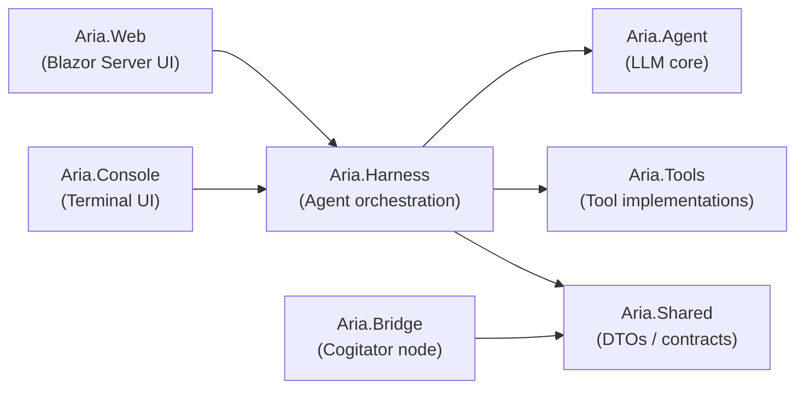

# Agent Harness (`Aria.Harness`)

This document describes the harness refactor: extracting the agent orchestration logic from `Aria.Web.Services.AgentService` into a shared `Aria.Harness` library that is now hosted by both `Aria.Web` and `Aria.Console`.

- [What changed](#what-changed)
- [New project layout](#new-project-layout)
- [Key contracts](#key-contracts)
- [Host adapters](#host-adapters)
- `AgentService` becomes a facade
- [Format cache](#format-cache)
- [Tests added](#tests-added)
- [Remaining work](#remaining-work)

---

## What changed

Previously, `Aria.Web.Services.AgentService` (and its partials) owned chat-client construction, tool assembly, reasoning/thinking handling, format detection, and streaming. That logic is now in `Aria.Harness`, while `AgentService` has been shrunk to a thin web-facing facade.

### Removed / consolidated

The obsolete `AgentService` partials were deleted:

- `AgentService.Session.cs`
- `AgentService.BridgeTools.cs`
- `AgentService.ThinkingDetection.cs`
- `AgentService.ToolCallDetection.cs`
- `AgentService.FormatCache.cs`

Their responsibilities moved into `Aria.Harness.Core.Harness` and supporting types.

### New `Aria.Harness` files

| File | Responsibility |
|---|---|
| `Aria.Harness/Core/IHarness.cs` | Public harness contract: session creation, streaming, format detection, forced re-detection. |
| `Aria.Harness/Core/Harness.cs` | Implementation of `IHarness`: builds chat clients, assembles tools, runs format detection, streams responses. |
| `Aria.Harness/Core/IHarnessRuntime.cs` | Host contract: source resolution, API keys, OAuth tokens, bridge access, format cache. |
| `Aria.Harness/Core/HarnessOptions.cs` | Host-agnostic options for one session. |
| `Aria.Harness/Core/HarnessContext.cs` | Per-operation context (`UserId`, `BridgeUserId`, cancellation). |
| `Aria.Harness/Bridge/BridgeMcpTool.cs` | `AIFunction` wrapper that invokes a bridge-backed MCP tool and reports start/complete callbacks. |
| `Aria.Harness/Bridge/BridgeToolInfo.cs` | DTO for a tool returned by the bridge `/tools/list` endpoint. |
| `Aria.Harness/Models/BridgeHttpHandler.cs` | `HttpMessageHandler` that routes LLM HTTP calls through `IHarnessRuntime.BridgeStreamAsync`. |
| `Aria.Harness/Tools/ActiveToolConfig.cs` | Lightweight descriptor for an enabled tool + optional config dictionary. |
| `Aria.Harness/Formats/IFormatCache.cs` | Abstraction over thinking/tool-call format caching. |
| `Aria.Harness/Formats/ThinkingFormat.cs` | Thinking format enum (`None`, `ThinkTags`, `ReasoningContent`, `StartsInThinkMode`, `ChannelThought`). |

### New / modified host adapter files

| File | Responsibility |
|---|---|
| `Aria.Web/Services/WebHarnessRuntime.cs` | Web implementation of `IHarnessRuntime`: DB sources, API keys, OAuth tokens fetched from the bridge, SignalR bridge, public-provider catalog. |
| `Aria.Web/Services/WebFormatCache.cs` | SQLite-backed `IFormatCache` using `ModelFormatCaches`. |
| `Aria.Web/Services/AgentService.cs` | Web facade over `IHarness`; keeps the original public surface for Blazor pages. |
| `Aria.Console/Harness/ConsoleHarnessRuntime.cs` | Console implementation of `IHarnessRuntime`: mandatory local bridge client. Reads synced sources from the bridge, checks bridge-held keys, and proxies LLM calls through `/llm/proxy`. |
| `Aria.Console/Harness/ConsoleFormatCache.cs` | In-memory `IFormatCache`. |
| `Aria.Console/BridgeConsoleClient.cs` | Typed HTTP client for the bridge `/console/*` and `/soul/*` endpoints. |
| `Aria.Console/ConsoleHelper.cs` | Warhammer-red themed prompts, ASCII favicon logo, agent/source/model/tool pickers. |
| `Aria.Console/Program.cs` | Auto-starts the bridge if needed, links a soul if missing, then runs the interactive chat loop through the harness. |

---

## New project layout



`Aria.Harness` sits between the frontends and the execution/transport layers. It does **not** replace `Aria.Bridge`; the bridge remains the local secure daemon that holds souls, keys, and MCP processes.

---

## Key contracts

### `IHarness`

```csharp
public interface IHarness
{
    Task<(AIAgent Agent, AgentSession Session)> CreateSessionAsync(
        HarnessOptions options, HarnessContext context, CancellationToken ct = default);

    IAsyncEnumerable<string> StreamAsync(
        string userMessage, AIAgent agent, AgentSession session,
        HarnessContext context, CancellationToken ct = default);

    Task<ToolCallFormat> DetectToolCallFormatAsync(
        string? sourceName, string? modelId, HarnessContext context, CancellationToken ct = default);

    Task<ThinkingFormat> DetectThinkingFormatAsync(
        string? sourceName, string? modelId, HarnessContext context, CancellationToken ct = default);

    Task<(ThinkingFormat Thinking, ToolCallFormat ToolCall)> ForceRedetectAsync(
        string sourceName, string modelId, HarnessContext context, CancellationToken ct = default);
}
```

### `IHarnessRuntime`

```csharp
public interface IHarnessRuntime
{
    ModelSource? FindSource(string? name, HarnessContext context);
    Task<string?> GetApiKeyAsync(string providerName, HarnessContext context, CancellationToken ct = default);
    Task<string?> GetOAuthTokenAsync(string providerName, HarnessContext context, CancellationToken ct = default);
    Task<bool> IsBridgeAvailableAsync(HarnessContext context, CancellationToken ct = default);
    Task<string> BridgePostAsync(string url, string body, HarnessContext context, CancellationToken ct = default, string? keyRef = null, bool requireKey = false);
    IAsyncEnumerable<string> BridgeStreamAsync(string url, string body, HarnessContext context, CancellationToken ct = default, string? keyRef = null, bool requireKey = false);
    IFormatCache FormatCache { get; }
}
```

---

## Host adapters

### Web host (`WebHarnessRuntime`)

- **Source resolution:** `UserLocalSourceService` (per-user local LLM sources from `aria.db`) plus the built-in public-provider catalog (`OpenAI`, `Anthropic`, `Google Gemini`, `Mistral`, `Groq`).
- **API keys:** read from `AppDbContext.UserLlmApiKeys` (base64-encoded, server-side but not secret — the real cloud keys live on the bridge node).
- **OAuth:** tokens are fetched from the bridge (`/oauth/{provider}/token`) at call time; the server never stores them.
- **Bridge:** routed through `ModelBridgeRegistry` / SignalR direct tunnel.
- **Format cache:** persisted in `ModelFormatCaches` via `WebFormatCache`.

### Console host (`ConsoleHarnessRuntime`)

- **Source resolution:** reads synced local sources from the bridge (`GET /console/sources`) and merges them with the shared public-provider catalog (`Aria.Harness.PublicModelSourceCatalog`). Optional FoundryLocal source is added if enabled in `appsettings.json`.
- **API keys:** cloud keys are held on the bridge; the runtime only checks presence via `GET /keys`.
- **OAuth:** tokens are pre-seeded after MSAL/Google desktop auth succeeds.
- **Bridge:** now mandatory. `IsBridgeAvailableAsync` always returns `true`; all public-provider and bridged LLM calls route through `POST /llm/proxy` on the local bridge.
- **Format cache:** in-memory `ConsoleFormatCache`, reset each run.

---

## `AgentService` becomes a facade

`Aria.Web.Services.AgentService` still has the same public methods the Blazor pages call, but it no longer contains orchestration logic. For example, `CreateSessionAsync` now:

1. Builds a `HarnessContext` from `userId` / `bridgeUserId`.
2. Builds a `HarnessOptions` from the web request (selected source/model, enabled tools, MCP servers, callbacks).
3. Ensures the runtime has the user's local sources cached.
4. Calls `_harness.CreateSessionAsync(options, context)`.

This means future harness improvements (new tool types, better format detection, etc.) apply to both Web and Console without duplicating code.

---

## Format cache

Format detection probes the model to learn how it emits reasoning/thinking and tool calls. The results are cached per `(endpointUrl, modelId)` so subsequent sessions start quickly.

- `IFormatCache` abstracts the storage.
- `WebFormatCache` loads all entries from `ModelFormatCaches` on first use, keeps a hot in-memory copy, and writes updates back to SQLite.
- `ConsoleFormatCache` is purely in-memory.
- `ForceRedetectAsync` invalidates the cache by writing `Unknown`, then re-runs detection. The harness ignores cached `Unknown` values, so the probe actually executes.

---

## Tests added

A new `Aria.Tests` project now covers the harness and integration points:

| Test class | What it verifies |
|---|---|
| `Aria.Tests.HarnessCore.HarnessTests` | Harness smoke tests with `ConsoleHarnessRuntime`: public providers return `ToolCallFormat.None`, source lookup by name, bridge unavailable in console mode. |
| `Aria.Tests.Web.IntegrationTests` | `WebApplicationFactory` tests for debug endpoints: chat sources, detect/probe, MCP bridge health/tools. |
| `Aria.Tests.Web.LocalLmIntegrationTests` | Reads the real local source from `Aria.Web/aria.db`, seeds an isolated `aria-tests-local.db`, and exercises live thinking/tool-call detection via `AgentService`. |

Run the suite:

```bash
cd src/AriaAgent
dotnet test
```

---

## Remaining work

- **End-to-end console verification.** The new bridge-backed console has been built and smoke-tested (bridge auto-start, sync, endpoints), but a full interactive chat turn through a real LLM is the final check.
- **Bidirectional editing.** Currently the console only *consumes* synced agents/tools/sources. Allowing the console to create or edit them and sync changes back to the server is a future enhancement.
- **Tool-call detection heuristics.** The local-LM probe currently returns `ToolCallFormat.Unknown` for some models that do not emit native `tool_calls` deltas or recognised tags. This is functionally correct (the harness falls back to plain chat), but more tag/JSON patterns can be added over time.
