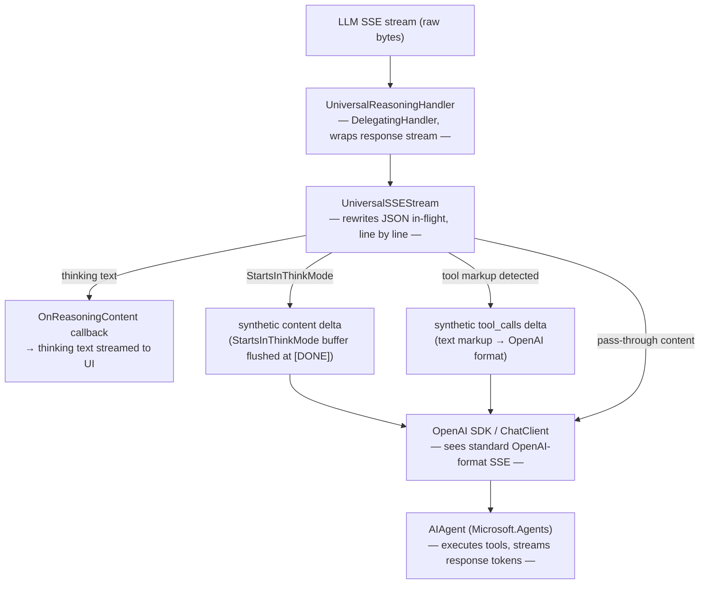

# // RITE OF DISCERNMENT — Universal Reasoning Handler

[← Back to the cogitator terminal](../../README.md)

How Aria reads the machine spirits' minds: a single SSE interceptor that normalises every model's *thinking* format and *tool-call* markup into clean OpenAI-format streaming, in-flight, before the SDK ever sees it.

- [Overview](#overview)
- [Thinking paths](#thinking-paths)
- [Tool-call paths](#tool-call-paths)
- [Data flow](#data-flow)
- [Notes & resources](#notes--resources)

---

## Overview

`UniversalReasoningHandler` is the single SSE interceptor used for all LLM providers. It sits in the `HttpClient` middleware pipeline, intercepts every `/v1/chat/completions` response stream, and rewrites it in-flight before the OpenAI SDK reads it.

> `FoundryLocalReasoningHandler` and `OpenAIReasoningHandler` are superseded and live in `Aria.Agent/Obsolete/`.

Wired up via `OpenAIClientOptions.Transport`:

```csharp
var handler = new UniversalReasoningHandler
{
    InnerHandler       = new HttpClientHandler(),
    OnReasoningContent = token => /* callback to UI */,
    StartsInThinkMode  = format == ThinkingFormat.StartsInThinkMode
};
var httpClient = new HttpClient(handler);
ChatClient chatClient = new(model, credential,
    new OpenAIClientOptions { Endpoint = endpoint,
        Transport = new HttpClientPipelineTransport(httpClient) });
```

`HttpClientPipelineTransport` is the bridge between the OpenAI SDK's `System.ClientModel` pipeline and a standard `HttpClient` — the officially supported injection point. In the Web UI, the handler's `InnerHandler` is the [`ModelBridgeHandler`](architecture.md#model-bridge), so reasoning interception runs server-side on the stream reconstructed from the daemon's `SendChunk` messages.

---

## Thinking paths

`UniversalSSEStream` (the inner `Stream` subclass) handles three thinking formats:

| Format | Models | How detected |
|---|---|---|
| `reasoning_content` JSON field | OpenAI o-series, DeepSeek R1, **anything served by LM Studio** (it parses the model's think tags into this field — Gemma 4 and Qwen distills arrive this way) | delta has `reasoning_content` key |
| `<think>…</think>` tags | raw Qwen/DeepSeek on servers that don't parse think tags (llama.cpp, vLLM) | `<think>` token appears in content |
| **StartsInThinkMode** | raw Qwen3-style models that open in think mode | `</think>` arrives with no prior `<think>` |
| **Harmony channels** | OpenAI GPT-OSS via LM Studio: `<|channel|>analysis…final` | `<|channel|>analysis` appears in content |

Auto-detection fires a probe request to the LLM endpoint before session creation and inspects SSE chunks; the result is cached per `(endpoint URL, model id)` in `ModelFormatCaches`. For bridged sources the probe runs **on the channel's bound bridge** (`/llm/detect-format`, key injected from that node's vault) — with multiple bridges, probing the default node would interrogate a different machine's model server.

### Probe outcome semantics (important)

- Positive detections and `None` ("probe succeeded, no thinking markers") are **cached**.
- `Unknown` means the probe **failed** (endpoint down, auth rejected). It is never cached and never
  feeds any assumption — the next session re-probes.
- There is deliberately **no model-name heuristic**. An earlier version forced `StartsInThinkMode`
  for qwen3/gemma-4/… names whenever the probe returned None; since probe *failures* also returned
  None, any endpoint hiccup (e.g. LM Studio auth being enabled) poisoned the cache and every
  subsequent answer streamed into the thinking block, leaving the reply empty. Conditional thinkers
  are safe without the heuristic: `reasoning_content` is handled dynamically whatever the verdict,
  and misdetected tag-thinkers degrade to visible think-text in the reply — ugly but never lost.
- Recovery from a stale verdict: Channels panel → **// MAINTENANCE → CLEAR MODEL FORMAT CACHE**, or
  `DELETE /api/maintenance/format-cache?model=<fragment>`.

Note that some models think **conditionally**: Gemma 4 answers a bare question with plain content
but reasons (via `reasoning_content`) once a system prompt and tool definitions are attached — so a
`None` verdict from the bare probe is correct *and* the thinking block still renders in real chats.

### StartsInThinkMode detail

When `StartsInThinkMode = true`, the stream starts with `_inThink = true`. **All** incoming content tokens go to `_thinkBuf` until the first `</think>` is seen.

At `[DONE]`:
- If `</think>` was never emitted, the entire buffer must be flushed as regular content — but only if the finish reason is `"stop"`. If it's `"tool_calls"`, the buffer is discarded (the model was reasoning about which tool to call; that reasoning must not appear as assistant message content, or downstream requests fail with a content-plus-tool_calls conflict).
- The `finish_reason` chunk is held in `_deferredFinishReasonLine` while `_inThink = true` to avoid premature emission. At `[DONE]`, it is re-emitted before `data: [DONE]`.

### Live thinking (`StreamThinkingLive`)

By default **all three** thinking paths buffer and emit reasoning in one shot (the `<think>`/StartsInThinkMode paths at `</think>`; the `reasoning_content` path when the answer starts) — so the thinking block appears all at once. When the format is a **confirmed** thinking format (`ReasoningContent`, `ThinkTags`, or `StartsInThinkMode`, from the probe/DB cache), `StreamThinkingLive` is set and each delta is emitted to `OnReasoningContent` *as it arrives* (`AppendThink` for the tag paths; direct per-delta for `reasoning_content`) — the UI streams reasoning token-by-token. Buffering still happens for unknown/None formats, so a first-encounter or mis-detect can never misroute the answer into the thinking block.

`reasoning_content` is unambiguous (always reasoning, never the answer), so streaming it is always safe. For the tag paths there's one edge case: a StartsInThinkMode model that emits no `</think>` with `finish=stop` will show the answer in *both* the thinking block and the reply (belt-and-suspenders — the answer is never lost).

### SSE event framing (critical)

The OpenAI SDK's SSE parser (`AsyncSseUpdateCollection`) accumulates `data:` lines until it sees a **blank line** (`\n\n`) terminating the event, then calls `JsonDocument.Parse` on the concatenated data. Synthetic events emitted by the handler **must** end with `\n\n` — a single `\n` causes the parser to merge consecutive synthetic events into one `data:` field containing two JSON objects, which `JsonDocument.Parse` rejects with `'{' is invalid after a single JSON value`.

This matters specifically for the StartsInThinkMode flush at `[DONE]`: the think-buffer content delta and the deferred finish-reason line are both synthetic, so each must carry `\n\n`.

---

## Tool-call paths

All tool-call paths rewrite non-standard text markup to proper OpenAI `tool_calls` SSE deltas. Auto-detected from the stream — no configuration required for local sources.

| Tag / format | Models | `ToolCallFormat` enum |
|---|---|---|
| `<tool_call>…</tool_call>` | Qwen, DeepSeek, Llama | `ToolCallTag` |
| `<start_function_call>…<end_function_call>` | Gemma | `StartFunctionCall` |
| `[TOOL_CALLS] [{…}]` | Mistral | `MistralToolCalls` |
| `<minimax:tool_call>…</minimax:tool_call>` | MiniMax | `MinimaxToolCall` |
| `<\|tool_calls_section_begin\|>…<\|tool_calls_section_end\|>` | Kimi K2 | `KimiK2` |
| `<longcat_tool_call>…</longcat_tool_call>` | Longcat | `Longcat` |
| `<arg_key>…</arg_key><arg_value>…</arg_value>` | GLM 4.7/5 | `GlmXml` |
| `<|channel|>analysis / commentary / final` | OpenAI GPT-OSS via LM Studio | `Harmony` |
| Native OpenAI `tool_calls` delta | Cloud APIs, standard endpoints | `None` (pass-through) |

Within `<tool_call>` blocks the handler understands three inner formats:

```
# JSON
{"name": "GetCurrentDateTime", "arguments": {}}

# XML function tag with JSON args
<function=Recall>{"query": "jl"}</function>

# XML function tag with parameter blocks (Qwen 3.5 default)
<function=Recall>
<parameter=query>jl</parameter>
</function>
```

`finish_reason` is rewritten from `"stop"` → `"tool_calls"` whenever a text-markup tool call was detected, so the SDK triggers tool execution.

---

## Data flow



---

## Notes & resources

### Upstream error surfacing

The bridge tunnel relays upstream responses as `200 text/event-stream` even when the model
endpoint failed — the transport cannot change the HTTP status once streaming starts. A raw error
body (`{"error":{"message":"…"}}`) used to parse as an empty SSE stream and produce a silent empty
reply. The handler now peeks the first bytes of every chat stream (replayed via `PrefixedStream`):
a JSON error object is drained and thrown as `HttpRequestException` carrying the upstream message,
which the chat renders as a visible `// COGITATOR FAULT //`. Real SSE (`data: …`) passes through
untouched. LM Studio quirk worth knowing: its API-token rejections log as
`Unexpected endpoint or method … Returning 200 anyway` on the LM Studio side — that's the auth
interceptor, not a URL problem.

### Why interception is needed

By default the `OpenAI` chat client hides the thinking content returned by the generic `/v1/chat` endpoint. `UniversalReasoningHandler` intercepts the raw SSE stream before the SDK reads it, auto-detects the thinking format, strips thinking from the visible stream, and invokes a callback with the buffered thinking text.

### Console: multi-line input & paste handling

The console prompt uses **bracketed paste mode** (`ESC[?2004h`). The terminal wraps pasted content in `ESC[200~…ESC[201~`, letting the app distinguish a typed `Enter` (submit) from a newline inside a paste (literal newline). Without it, pasting multi-paragraph text fires one submission per line. Supported by all modern macOS terminals and most Linux terminals; where unsupported, the escapes are silently ignored and `Enter` submits as normal.

### Reference links

- [`HttpClientPipelineTransport`](https://learn.microsoft.com/en-us/dotnet/api/system.clientmodel.primitives.httpclientpipelinetransport?view=azure-dotnet) — the `PipelineTransport` wrapping an `HttpClient`; the injection point used above.
- [`openai-dotnet` readme](https://github.com/openai/openai-dotnet) — documents custom `Endpoint` for OpenAI-compatible APIs (but nothing about response interception).
- [`DelegatingHandler` middleware](https://learn.microsoft.com/en-us/aspnet/core/fundamentals/http-requests#outgoing-request-middleware) — standard .NET pattern.

There is **no** official documentation for response-stream interception of custom fields like `reasoning_content` — the SDK was never designed for third-party extensions to the SSE format, which is why this handler exists.
